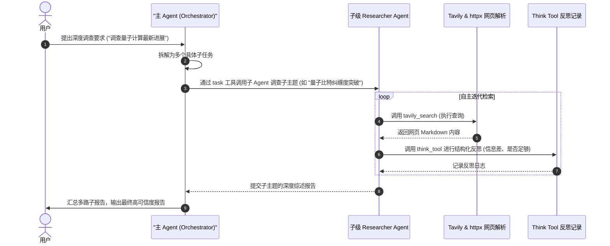

# Deep Research - 深度检索与自主反思 Agent 深度剖析

`deep_research` 是一个经典的**多步骤网络检索与反思**示例。该示例展示了如何基于大语言模型构建一个深度调查助手，利用 Tavily 进行并发搜索，并通过专门的“反思工具”在搜索过程中自我调整检索方向，直到任务彻底完成。

---

## 🎯 核心使用场景与设计目的

在大规模检索任务中，传统的 Single-shot Agent 往往在完成一次搜索后就仓促给出结论，容易导致幻觉或信息缺失。
`deep_research` 通过以下设计解决该问题：
1. **Orchestrator - Subagent (主从编排)**：主 Agent 负责总览全局并分配具体主题，专职 Research Agent 负责在一个个子主题上执行具体的检索动作。
2. **Think/Reflect ( deliberate pause，刻意停顿反思)**：引入 `think_tool`，强迫模型在每次搜索完后，分析当前结果，寻找信息差（Information Gap），决定下一步继续检索还是收敛汇报。

---

## 🏗️ 架构与控制流

主 Agent 和 Sub-agent 均通过 `create_deep_agent` 进行构建：



---

## 💻 核心代码剖析

### 1. 并发度与重试控制
在 `agent.py` 中，定义了核心流程控制的参数：
```python
max_concurrent_research_units = 3  # 最多并行调查 3 个子课题
max_researcher_iterations = 3       # 每个 Researcher 最多循环迭代搜索 3 次
```

### 2. 工具设计与大文件解析 (`tavily_search`)
`tavily_search` 绝不是简单的返回 API 摘要，而是**实时抓取网页 HTML 并还原为干净的 Markdown**。
```python
import httpx
from markdownify import markdownify
from tavily import TavilyClient
from langchain_core.tools import tool
from typing_extensions import Annotated, Literal
from langchain.tools import InjectedToolArg

tavily_client = TavilyClient()

def fetch_webpage_content(url: str, timeout: float = 10.0) -> str:
    """实时请求网页并将 HTML 转换为 Markdown 字符串"""
    headers = {"User-Agent": "Mozilla/5.0 ..."}
    try:
        response = httpx.get(url, headers=headers, timeout=timeout)
        response.raise_for_status()
        return markdownify(response.text) # 将完整的网页 HTML 转为 Markdown
    except Exception as e:
        return f"抓取网页失败 {url}: {str(e)}"

@tool(parse_docstring=True)
def tavily_search(
    query: str,
    max_results: Annotated[int, InjectedToolArg] = 1, # 参数由系统注入，模型不可改
    topic: Annotated[Literal["general", "news", "finance"], InjectedToolArg] = "general",
) -> str:
    """在网络上检索指定 query 的信息，实时爬取其网页原文并转化为 Markdown 返回。"""
    search_results = tavily_client.search(query, max_results=max_results, topic=topic)
    result_texts = []
    for result in search_results.get("results", []):
        url = result["url"]
        title = result["title"]
        content = fetch_webpage_content(url)
        result_texts.append(f"## {title}\n**URL:** {url}\n\n{content}\n---")
    return "\n".join(result_texts)
```

### 3. 刻意反思工具 (`think_tool`)
通过强迫模型输入“反思内容”，实现战略性反思：
```python
@tool(parse_docstring=True)
def think_tool(reflection: str) -> str:
    """战略反思工具。当检索到新数据后，用以分析当前进度、寻找盲区并规划下一步。
    
    参数:
        reflection: 对研究进展、差距和下一步计划的深度反思与说明。
    """
    return f"反思已记录: {reflection}"
```

---

## 🛠️ 项目实战复用指南

如果您在自己的 Agent 项目中，需要开发一套能够**自主搜索网页、深度研究特定课题**的模块，可以直接复用以下集成模板：

```python
# file: custom_researcher.py
import os
from datetime import datetime
from deepagents import create_deep_agent
from langchain.chat_models import init_chat_model
from langchain_core.tools import tool

# 1. 声明自定义工具
@tool
def google_search(query: str) -> str:
    """简单的网络搜索引擎。"""
    # 在此实现您的搜索逻辑（如 Tavily, Google, Bing 等）
    return f"关于 '{query}' 的搜索结果..."

@tool
def reflect(gap_analysis: str) -> str:
    """记录分析并评估是否需要更多的检索动作。"""
    return f"反思就绪: {gap_analysis}"

# 2. 定义研究子 Agent
research_sub_agent = {
    "name": "deep-scholar",
    "description": "专职检索学者，负责针对特定单一课题开展细致搜索与文献抓取。",
    "system_prompt": (
        "你是一个极其细致的检索学者。每次使用搜索工具后，你必须使用 reflect 工具，"
        "分析得到的信息，指出还缺少什么，并决定是否继续搜索。当证据确凿时方可收网工作。"
    ),
    "tools": [google_search, reflect],
}

# 3. 组装主编排 Agent
orchestrator_model = init_chat_model("anthropic:claude-sonnet-4-6", temperature=0.0)

deep_scholar_agent = create_deep_agent(
    model=orchestrator_model,
    system_prompt=(
        "你是一个深度报告总编。用户会让你就一个大议题撰写研究报告。\n"
        "1. 将议题拆分为 2-3 个微观课题。\n"
        "2. 调用 task 工具分配任务给 `deep-scholar` 子 Agent。\n"
        "3. 汇总子 Agent 返回的所有文献证据，撰写一篇高度结构化的行业白皮书。"
    ),
    subagents=[research_sub_agent], # 注册子 Agent
)

# 4. 执行调用
if __name__ == "__main__":
    # 确保设置了 API 密钥
    # os.environ["ANTHROPIC_API_KEY"] = "your-key"
    
    question = "深度分析 2026 年固态电池商业化进展与主要厂商瓶颈"
    
    print("Orchestrator 启动研究流...")
    response = deep_scholar_agent.invoke(
        {"messages": [("user", question)]}
    )
    
    print("\n--- 最终生成的深度报告 ---")
    print(response["messages"][-1].content)
```

**复用提示**：
- 在调用子 Agent 时，大模型使用内置的 `task` 工具。例如：`tools.task({subagent_type: "deep-scholar", description: "固态电池阳极材料进展"})`。
- 子 Agent 的执行是全自动且在独立的子图中运行的，这能够有效控制 Token 的增长和上下文污染。
