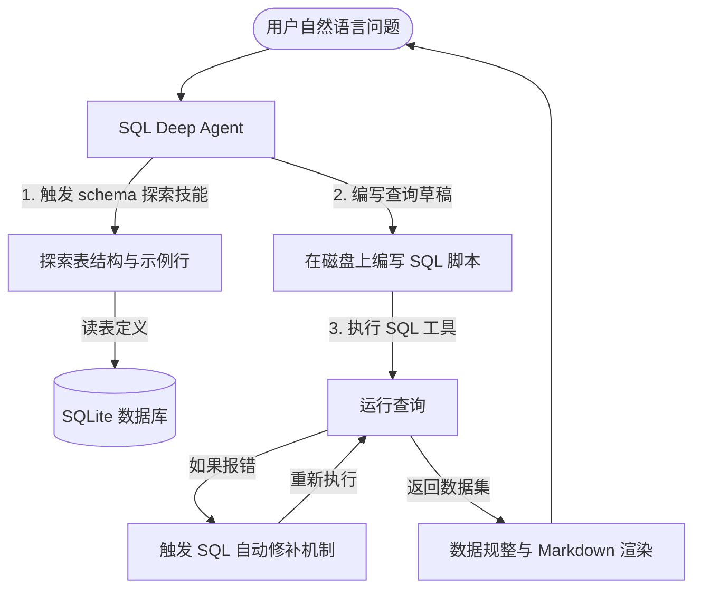

# Text-to-SQL Agent - 数据库智能查询 Agent 深度剖析

`text-to-sql-agent` 示例展示了如何将 Deep Agents Harness 应用于关系型数据库（SQLite/Chinook 音乐商店数据库）的智能问答。通过结合 `SQLDatabaseToolkit` 以及专用的 `skills`，大模型能够像一名真正的 DBA 一样：**探索 Schema -> 编写 SQL 语句 -> 在沙盒中执行查询 -> 根据报错自动修复 -> 整理出直观图表与结论**。

---

## 🎯 核心使用场景与设计目的

在复杂的数据库分析场景下，普通的 LangChain SQL Agent 经常会因为大模型写出损坏的 SQL 或错误的表关联而报错终止。
`text-to-sql-agent` 引入了以下进阶特性：
1. **Durable Workspace & Skills (持久工作空间与专门技能)**：将数据库结构探索、复杂多表 Join 优化、报错自动修复等步骤提炼为标准的 `skills` 文件，由 `SkillsMiddleware` 加载。
2. **FilesystemBackend (文件系统后端)**：允许 Agent 在物理磁盘上进行 SQL 的草稿编写与数据落地，并在跨 Session 时保留其所有的调试痕迹与工作上下文。

---

## 🏗️ 架构与控制流



---

## 💻 核心代码剖析

### 1. 结合 `SQLDatabaseToolkit` 初始化 Agent
在 `agent.py` 中，数据库连接和工具链的初始化流程非常清晰：
```python
import os
from deepagents import create_deep_agent
from deepagents.backends import FilesystemBackend
from langchain_community.agent_toolkits import SQLDatabaseToolkit
from langchain_community.utilities import SQLDatabase
from langchain_anthropic import ChatAnthropic

def create_sql_deep_agent():
    base_dir = os.path.dirname(os.path.abspath(__file__))
    
    # 1. 建立 SQLite 连接，并设定每次抽取表结构时带上 3 行真实样本（利于模型学习数据格式）
    db_path = os.path.join(base_dir, "chinook.db")
    db = SQLDatabase.from_uri(f"sqlite:///{db_path}", sample_rows_in_table_info=3)
    
    # 2. 构建 Claude-3.5-Sonnet 大模型与 SQL 工具集
    model = ChatAnthropic(model="claude-sonnet-4-5-20250929", temperature=0)
    toolkit = SQLDatabaseToolkit(db=db, llm=model)
    sql_tools = toolkit.get_tools() # 包含 sql_db_query, sql_db_schema 等核心工具
    
    # 3. 装配主 Deep Agent 
    agent = create_deep_agent(
        model=model,
        memory=["./AGENTS.md"],        # 读取全局 DBA 指导说明
        skills=["./skills/"],          # 加载表查询与 SQL 重构核心技能
        tools=sql_tools,               # 注册 SQL 数据库工具集
        backend=FilesystemBackend(root_dir=base_dir), # 文件系统持久化
    )
    return agent
```

### 2. 核心 SQL 编写技能的配置 (`skills/`)
让我们来看看在 SQL 场景中，是如何通过 Skill 规范来控制模型行为的。以下是 `skills/query-writing/SKILL.md` 的精简逻辑：
```yaml
---
name: query-writing
description: >-
  编写 SQL 查询来回答复杂的业务指标。
  包含多表 Join、聚合（GROUP BY）与排序。
---

# 编写 SQL 技能要求

当你需要编写 SQL 时，请严格遵守以下步骤：
1. **先探索，再编写**：除非你百分之百确信，否则在编写 SQL 之前，必须先使用 `sql_db_schema` 获取目标表的字段定义。
2. **严禁使用 SELECT * **：为了查询效率和规范性，必须写明具体需要的字段名。
3. **编写 SQL 草稿**：使用 `write_file` 将复杂的 SQL 写入工作区（如 `query.sql`），然后通过执行工具在本地数据库测试运行。
4. **异常修复机制**：如果 SQL 运行报错，必须将错误日志读回，进行语法修正。
```

---

## 🛠️ 项目实战复用指南

如果您在自己的 SaaS 项目或企业内网中，需要开发一个**能够让非技术人员直接查库并生成业务报表**的 Agent，可以直接复用以下集成模板：

```python
# file: custom_sql_agent.py
import os
from deepagents import create_deep_agent
from deepagents.backends import FilesystemBackend
from langchain_community.agent_toolkits import SQLDatabaseToolkit
from langchain_community.utilities import SQLDatabase
from langchain_openai import ChatOpenAI

# 确保在当前目录下建有 skills/ 目录，并在其中放入 SKILL.md
def get_intelligent_dba_agent(db_connection_uri: str, workspace_path: str):
    """
    组装一个支持 Skills 扩展的智能 DBA 助手。
    """
    # 1. 初始化数据库连接 (例如 PostgreSQL 或 MySQL, 这里以本地 SQLite 为例)
    db = SQLDatabase.from_uri(db_connection_uri, sample_rows_in_table_info=3)
    
    # 2. 选用对结构化 Tool Calling 极佳的 GPT-4o 模型
    llm = ChatOpenAI(model="gpt-4o", temperature=0.0)
    
    # 3. 构建标准数据库工具箱
    toolkit = SQLDatabaseToolkit(db=db, llm=llm)
    database_tools = toolkit.get_tools()
    
    # 4. 创建带有物理 Workspace 的 Deep Agent 
    # 该 Agent 在遇到语法报错时会通过本地文件系统进行 SQL 草稿调试
    agent = create_deep_agent(
        model=llm,
        tools=database_tools,
        skills=[os.path.join(workspace_path, "skills")], # 加载本地技能夹
        backend=FilesystemBackend(root_dir=workspace_path),
        system_prompt=(
            "你是一名首席商业分析师与 DBA。\n"
            "你的任务是为决策者从数据库中挖掘真实指标。\n"
            "在输出最终结论时，必须在 Markdown 中以漂亮的表格（Table）形式展现数据！"
        )
    )
    return agent

if __name__ == "__main__":
    # 快速启动测试
    # os.environ["OPENAI_API_KEY"] = "your-openai-key"
    
    workspace = "./dba_sandbox"
    os.makedirs(os.path.join(workspace, "skills/query-writing"), exist_ok=True)
    
    # 快速预置一个技能定义
    skill_content = """---
name: schema-exploration
description: 探索表关联。
---
优先调用 sql_db_schema 拿到主外键关联关系。
"""
    with open(os.path.join(workspace, "skills/query-writing/SKILL.md"), "w") as f:
        f.write(skill_content)
        
    db_uri = "sqlite:///chinook.db"  # 替换为您的实际数据库
    
    if os.path.exists("chinook.db"):
        dba_bot = get_intelligent_dba_agent(db_uri, workspace)
        
        user_query = "哪五个国家的客户在我们的音乐商店中消费的总金额最高？请列出消费额和客户数。"
        print(f"正在分析问题: {user_query}")
        
        state = dba_bot.invoke({"messages": [("user", user_query)]})
        print("\n--- 最终生成的分析报表 ---")
        print(state["messages"][-1].content)
    else:
        print("未在当前路径找到 chinook.db 示例数据库，请从 examples 中拷贝以供测试。")
```

**复用提示**：
- 连接不同数据库（MySQL, SQL Server, PostgreSQL）时，只需修改 `SQLDatabase.from_uri` 传入的连接串即可，无需更改 Agent 的任何逻辑。
- 强烈建议保留 `sample_rows_in_table_info=3`，这能大幅提升大模型在识别“主键外键关联方式”、“枚举值代表的具体含义”等维度的成功率。
