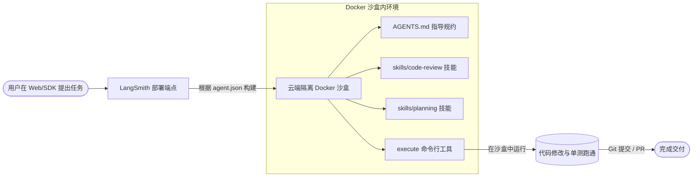

# Deploy Coding Agent - 云端沙盒编程 Agent 深度剖析

`deploy-coding-agent` 展示了如何通过 Deep Agents 的声明式配置，将其一键部署（Deploy）到 LangSmith Platform 作为云端的**全自动编码助手**。该 Agent 运行在完全隔离的安全沙盒（Sandbox）中，支持完整的 Shell 指令、Git 提币、自动化测试以及人机交互式的代码评审机制。

---

## 🎯 核心使用场景与设计目的

将编程 Agent 暴露给团队或外部使用时，通常面临两大难题：**环境安全性（恶意代码破坏主机）** 和 **代码规范一致性**。
`deploy-coding-agent` 的设计优雅地解决了这一问题：
1. **LangSmith Sandbox (沙盒隔离)**：Agent 不直接接触物理机，所有读写、Shell 指令均在 LangSmith 托管的云端 Docker 中运行，安全性极其牢靠。
2. **Configuration-Driven (配置驱动)**：不需要编写一行 Python 代码！只需定义 `agent.json`（设定模型与身份）、`AGENTS.md`（说明任务准则与工作流）以及 `skills/`（挂载开发规范）。

---

## 🏗️ 架构与控制流



---

## 💻 核心代码与配置剖析

### 1. 声明式部署文件 (`agent.json`)
部署到云端时，部署命令行 `deepagents deploy` 会优先读取当前文件夹下的 `agent.json`：
```json
{
  "name": "deepagents-deploy-coding-agent",
  "runtime": {
    "model": {"model_id": "anthropic:claude-sonnet-4-5"}
  }
}
```
*提示*：声明了 Agent 名称和所用模型，Deep Agents 平台会自动将同目录下的 `AGENTS.md` 识别为 Memory，`skills/` 识别为 Skills 挂载加载。

### 2. 行为准则文件 (`AGENTS.md`)
`AGENTS.md` 文件是 Agent 的系统大脑和操作说明，规定了它的标准开发周期：
```markdown
# 软件开发 Agent 行为规范

你是一个自主的资深软件工程师。你拥有完整的 Shell 和文件读写权限。

## 核心工作流流程

当你接收到需求时，必须严格执行以下四步工作法：
1. **Plan (规划阶段)**：探索代码库结构，列出需要修改的组件及潜在的副作用。
2. **Implement (编写阶段)**：编写高质量、带完备类型提示（Type Hints）的代码。
3. **Review (评审阶段)**：必须调用本地测试指令（如 `pytest`），并使用 linter 工具进行语法自检。
4. **Deliver (交付阶段)**：在所有测试和 Lint 跑通后，使用 Git 提交并整理出最终的交付说明。
```

### 3. 规划与代码审查技能设计 (`skills/planning/SKILL.md`)
通过向 Agent 注入 `skills/planning/SKILL.md`，引导模型在编写代码前创建一份“任务计划”：
```yaml
---
name: task-planning
description: 创建任务规划以追踪工作进度。
trigger_on: 新的编码需求, 代码重构任务, 复杂逻辑设计
---
# 任务规划技能

在修改任何代码之前，必须先在工作区创建一个 `task.md` 文件：
- 使用 `[ ]` 表示待办项，`[x]` 表示已完成。
- 每完成一个组件的修改，立即更新该文件。
- 确保测试用例编写本身也被列入待办清单中。
```

---

## 🛠️ 项目实战复用指南

如果您希望在您的团队中部署一个**企业内部专用的云端编程助手**（比如对接 Slack、GitLab），可以直接复用以下项目布局和调用模式：

### 1. 物理目录结构
在您的项目库中，创建如下结构的文件夹，并直接提交至 Git：
```text
my-coding-bot/
├── agent.json               # 模型与部署配置
├── AGENTS.md                # 编码规范与工作流定义
└── skills/                  # 自定义开发技能库
    ├── planning/
    │   └── SKILL.md         # 规划技能
    └── format-preferences/
        └── SKILL.md         # 代码格式与规范化控制
```

### 2. 核心部署配置文件模板

**`agent.json`**：
```json
{
  "name": "corporate-python-engineer",
  "runtime": {
    "model": {
      "model_id": "anthropic:claude-sonnet-4-6"
    }
  }
}
```

**`skills/format-preferences/SKILL.md`**：
```yaml
---
name: format-preferences
description: 限制代码格式与 Lint 规范。
---
# Python 代码格式规范

在编写 Python 文件时，必须遵守以下格式：
1. 优先使用 Python 3.11+ 的新版类型提示（例如 `dict[str, Any]`，而不是 `typing.Dict`）。
2. 在所有公共函数和类中写入详细的 Google 风格 Docstring。
3. 修改完成后，在沙盒终端内执行 `black .` 和 `ruff check .`，修正所有的格式违规。
```

### 3. Python SDK 调用与流式输出模板
部署完成后，您可以使用 **LangGraph SDK** 在您的后台、Slack 机器人或 Web 页面上拉起与它的对话：

```python
# file: invoke_bot.py
import asyncio
from langgraph_sdk import get_client

async def run_coding_bot():
    # 1. 连接到您的 LangSmith 部署端点
    # 平台会全自动拉起一个 Docker 沙盒，并将您的 skills/ 与 AGENTS.md 拷贝进去
    client = get_client(url="https://api.smith.langchain.com") # 或者您的私有部署 URL
    
    # 2. 创建一个会话线程
    thread = await client.threads.create()
    
    task_desc = "在当前工作区创建一个 hello.py 文件，编写一个实现斐波那契数列的函数并配套编写 pytest 单元测试。"
    print(f"正在向云端沙盒发送任务...")
    
    # 3. 流式获取模型输出与工具执行痕迹
    async for chunk in client.runs.stream(
        thread["thread_id"],
        "agent", # 默认部署的 agent 名
        input={"messages": [{"role": "user", "content": task_desc}]},
        stream_mode="messages",
    ):
        # 实时打印 Claude 在沙盒里的思考、写文件、跑测试的全部终端输出
        if chunk.data:
            print(chunk.data, end="", flush=True)

if __name__ == "__main__":
    asyncio.run(run_coding_bot())
```

**复用提示**：
- **HITL (人机协同审批)**：如果您担心 Agent 自主运行 Shell 命令的风险，可以在 `agent.json` 中配置 `interrupt_on`，例如 `"runtime": {"interrupt_on": {"execute": true}}`。这样每次 Agent 在沙盒里执行外部命令（如跑测试或装依赖）时，会向 Web 控制端发送审批，直到您在界面上点“同意”才会继续。
