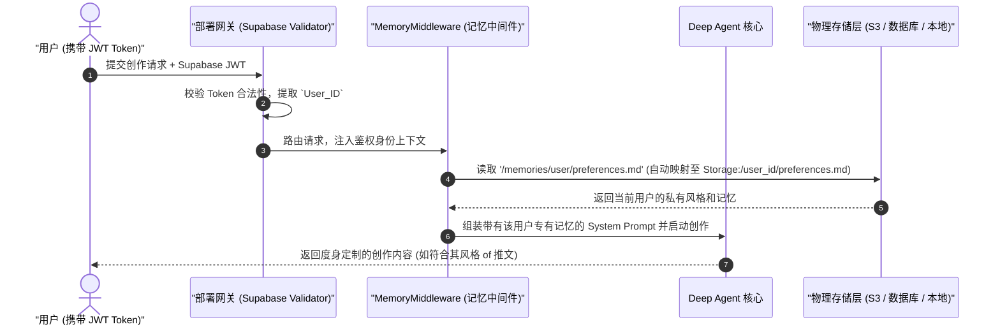

# Deploy Content Writer - Supabase 鉴权与多用户隔离记忆 Agent 深度剖析

`deploy-content-writer` 是一个专门面向 SaaS 生产环境的经典示例。它演示了如何部署一个支持 **Supabase JWT 鉴权** 的内容创作助手。该 Agent 拥有先进的 **Per-User Memory (多用户隔离记忆)**，能够保证不同的企业租户或用户在使用同一个 Agent 部署端点时，其个人的写作风格、品牌偏好、私有上下文被绝对物理隔离在各自的存储路径下，互不混淆。

---

## 🎯 核心使用场景与设计目的

在开发面向多用户的 AI 服务时，**数据隔离** 与 **鉴权校验** 是避无可避的安全红线。
如果为每一个用户都写一遍“加载偏好数据库 -> 拼入 System Prompt -> 运行完存回”的逻辑，代码会变得极其臃肿。
`deploy-content-writer` 采用了框架层级的**零代码鉴权与自动路径路由**设计：
1. **Low-Code Custom Auth (低代码 Supabase 鉴权)**：只需在 `deepagents.toml` 中配置 Supabase 的 URL 和 Key，网关层会自动校验每次 HTTP 请求中的 `Authorization: Bearer <JWT>`。
2. **User Identity Routing (用户身份自动路由存储)**：校验通过后，Agent 自动将当前用户的记忆加载和写入路径限制在虚拟文件系统的 `/memories/user/` 下（映射到后端的特定用户文件夹），开发者无需在代码里写任何条件判断！

---

## 🏗️ 架构与控制流



---

## 💻 核心配置与代码剖析

### 1. 低代码鉴权配置文件 (`deepagents.toml`)
这是决定网关鉴权和用户身份提取的核心配置文件：
```toml
# deepagents.toml
[auth]
provider = "supabase"

[auth.supabase]
url = "https://your-project.supabase.co"
anon_key = "your-supabase-anon-key"
```
*提示*：一旦启用此配置，任何没有携带合法 Supabase JWT 或过期 Token 的 API 请求均会被网关直接拒绝（HTTP 401），保证了 Agent 物理算力的安全。

### 2. 行为准则文件中的记忆加载规则 (`AGENTS.md`)
Agent 在 `AGENTS.md` 中被告知要主动读写和修正 `/memories/user/` 下的存储，作为其跨 Session 记忆：
```markdown
# 写作助手记忆管理规范

你是一个专业的写作助手。你会被多个不同的用户调用。你必须为每个用户维护好他专属的偏好设定。

## 记忆存储说明
你的个人记忆与偏好保存在以下文件中：
- `/memories/user/preferences.md`：记录该用户的写作语气（Casual, Formal 等）、偏好用词、排版格式。
- `/memories/user/context.md`：记录该用户当前服务的公司、主要产品及受众群体。

## 自我演进记忆机制
如果在对话中，用户对你提出了格式或语气上的纠正（例如：“我喜欢段落间空两行，请记住这个习惯”），你必须：
1. 立即使用 `edit_file` 或 `write_file` 更新 `/memories/user/preferences.md`，将这一习惯固化记录。
2. 告知用户你已将偏好写入记忆，未来所有新会话都将自动生效。
```

---

## 🛠️ 项目实战复用指南

如果您在开发自己的 SaaS 产品，需要为**成千上万个付费用户提供具有“记忆保留”能力的 Agent 助理**，可以直接复用以下集成模板：

### 1. SaaS 项目物理文件夹结构
```text
content-writer-saas/
├── deepagents.toml         # 网关与 Supabase Auth 定义
├── AGENTS.md               # 写入了 `/memories/user/` 维护规约的指令
├── user/
│   ├── preferences.md      # 用户偏好模板文件（系统首次初始化时注入）
│   └── context.md          # 用户公司背景模板文件
└── skills/
    └── draft-generator/
        └── SKILL.md        # 内容起草技能
```

### 2. 多租户记忆测试脚本 (`test_user_memory.py`)
在本地或服务器端测试鉴权和隔离记忆的脚本。通过传入不同用户的 JWT Token，验证存储的天然隔离性：

```python
# file: test_isolated_memory.py
import asyncio
from langgraph_sdk import get_client

async def test_user_flow(user_jwt: str, user_name: str):
    """
    模拟特定用户的请求。网关会自动根据 Authorization 头里的 JWT 
    在后台将虚拟路径 `/memories/user/` 重映射为该用户的专属云存储目录。
    """
    # 1. 携带用户 JWT 初始化 SDK 客户端
    client = get_client(
        url="https://your-deployed-agent.langchain.app", # 您的云端 Agent 服务地址
        headers={"Authorization": f"Bearer {user_jwt}"}
    )
    
    # 2. 创建用户专属的 Thread (会话线程)
    thread = await client.threads.create()
    
    # 3. 第一次请求：告诉 Agent 偏好
    print(f"\n--- 正在为用户 {user_name} 设定偏好偏好 ---")
    setup_prompt = f"我是{user_name}。我偏好使用极简的科技风写作，段落间习惯使用 Markdown 分割线（---）。请记录这个偏好。"
    
    async for chunk in client.runs.stream(
        thread["thread_id"],
        "agent",
        input={"messages": [{"role": "user", "content": setup_prompt}]},
        stream_mode="messages",
    ):
        if chunk.data:
            print(chunk.data, end="", flush=True)

    # 4. 第二次请求：验证偏好是否起效（它已经固化写入了虚拟的 `/memories/user/preferences.md`）
    print(f"\n\n--- 正在验证用户 {user_name} 的固化记忆 ---")
    test_prompt = "为我们的固态电池新品发布写一条 100 字的短文。"
    
    async for chunk in client.runs.stream(
        thread["thread_id"],
        "agent",
        input={"messages": [{"role": "user", "content": test_prompt}]},
        stream_mode="messages",
    ):
        if chunk.data:
            print(chunk.data, end="", flush=True)

if __name__ == "__main__":
    # 在真实运行中，这两个 Token 是通过 Supabase Auth SDK 在前端登录时拿到的真实用户 JWT。
    USER_A_JWT = "eyJhbGciOi..."
    USER_B_JWT = "eyJhbGciOi..."
    
    # 并发测试两个用户，他们所修改和调用的 `/memories/user/preferences.md` 将完全隔离！
    async def main():
        await test_user_flow(USER_A_JWT, "爱达")
        await test_user_flow(USER_B_JWT, "巴贝奇")
        
    asyncio.run(main())
```

**复用提示**：
- **无须数据库维护**：通常在传统的 LangChain 应用中，您需要自己建一张 MySQL/PostgreSQL 用户表来存储 `user_preferences`。在 Deep Agents Harness 下，系统通过底层中间件全自动将用户的记忆文件持久化到您配置的 Backend (如云端 S3 或云原生盘) 中。这大大简化了系统开发，提升了扩展性能。
