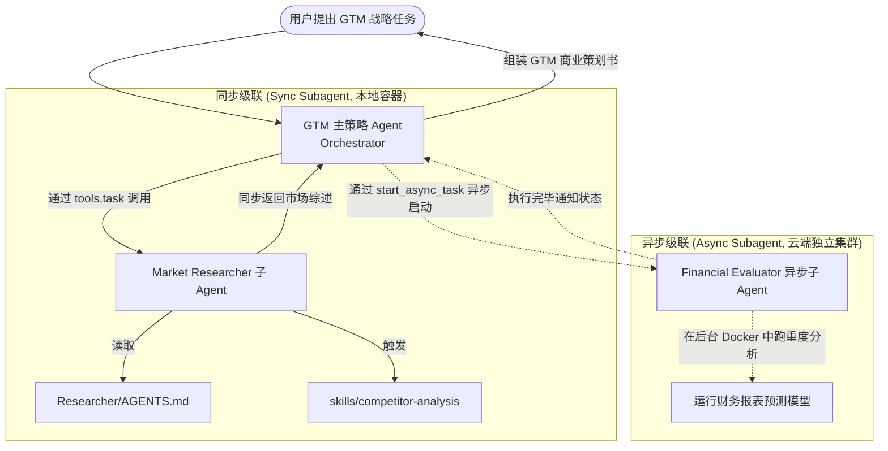

# Deploy GTM Agent - 同步与异步子级 Agent 级联编排深度剖析

`deploy-gtm-agent` 示例展示了一个极为高级的、针对**市场进入策略（Go-To-Market, GTM）**的复杂多角色 Agent 编排模式。该示例完美诠释了如何通过声明式配置，将一个主策略 Agent (Orchestrator) 与多个位于不同物理节点、甚至拥有不同模型和鉴权证书的**同步子级 Agent (Synchronous Subagents)** 和 **异步子级 Agent (Asynchronous Subagents)** 进行无缝级联。

---

## 🎯 核心使用场景与设计目的

在处理企业级复杂战略任务（如撰写一份完整的商业策划案）时，单一的 Agent 往往心有余而力不足：
- **同步子任务阻碍效率**：如果主 Agent 必须等待所有研究子课题一个个做完才继续，执行时间将无限拉长。
- **上下文污染**：庞大的市场数据和竞品调研数据会瞬间撑爆模型的上下文窗口（Context Window），导致逻辑混乱。

`deploy-gtm-agent` 提出了**级联式多层上下文路由**设计：
1. **Directories-as-Subagents (目录即子 Agent 自动识别)**：在 `subagents/` 文件夹下创建一个子目录，云端部署 CLI 就会全自动将其识别为一个独立的子 Agent。该子 Agent 拥有专属的 `AGENTS.md` 行为定义以及专属的 `skills/` 工具包，主 Agent 通过标准的 `task` 工具即可向其委派任务。
2. **混合编排流**：有些重度消耗时间的分析（如 "下载所有竞品财报并生成图表"）被委派给云端的 `AsyncSubAgent` (异步子 Agent)，让其在后台独立长周期执行，主 Agent 则立刻释放，通过轮询或状态通知获取其结果，大大节省了前台阻断时间。

---

## 🏗️ 架构与控制流



---

## 💻 核心配置剖析

### 1. 主 Agent 部署配置文件 (`agent.json`)
主 Agent 被声明为一个由 GPT-5.4-nano 驱动的宏观战略协调器：
```json
{
  "name": "deepagents-deploy-gtm-agent",
  "description": "负责协调市场研究与内容创作的 Go-to-market 战略规划 Agent",
  "runtime": {
    "model": {"model_id": "openai:gpt-5.4-nano"}
  }
}
```

### 2. 目录级同步子级 Agent 的自适应注册 (`subagents/market-researcher/`)
要为主 Agent 挂载一个名为 `market-researcher` 的同步子 Agent，在 Deep Agents 中**无需编写任何 Python 注册代码**，只需创建如下文件夹结构即可：
```text
deploy-gtm-agent/
├── agent.json                  # 主 Agent 配置
├── subagents/
│   └── market-researcher/      # 该目录自动注册为名为 'market-researcher' 的子 Agent
│       ├── agent.json          # 子级 Agent 可选用不同的模型，如 claude-haiku-4-5
│       ├── AGENTS.md           # 子级 Researcher 的核心指令
│       └── skills/
│           └── competitor-analysis/
│               └── SKILL.md    # 子级专用的竞品分析技能
```

**`subagents/market-researcher/agent.json`**：
```json
{
  "name": "gtm-market-researcher",
  "runtime": {
    "model": {"model_id": "anthropic:claude-haiku-4-5"}
  }
}
```
*技术内幕*：当主 Agent 被部署时，部署网关在解析目录结构时，会自动识别 `subagents/` 目录。它会构建出一个独立运行的 `SubAgent` 定义，将其对应的模型（Claude Haiku）、专有指令（Researcher/AGENTS.md）及技能装配起来，并在主 Agent 的 `tools.task` 列表中暴露给 Orchestrator。

---

## 🛠️ 项目实战复用指南

如果您在为您的企业开发一个**复杂的战略规划 Agent 集群**（例如：自动撰写投资意向书、法务合规双审系统），可以直接复用以下声明式目录结构与集成模板：

### 1. 标准企业级级联布局
```text
strategic-planner/
├── agent.json               # 主战略协调 Agent 配置
├── AGENTS.md                # 主协调 Agent 指导大纲
├── skills/
│   └── plan-synthesizer/    # 主协调 Agent 专用的草稿综合技能
│       └── SKILL.md
└── subagents/               # 子级 Agent 目录
    ├── competitor-analyst/  # 子 Agent 1：竞品分析师
    │   ├── agent.json
    │   ├── AGENTS.md
    │   └── skills/
    │       └── matrix-builder/
    │           └── SKILL.md
    └── compliance-auditor/  # 子 Agent 2：合规审查官
        ├── agent.json
        ├── AGENTS.md
        └── skills/
            └── regulation-checker/
                └── SKILL.md
```

### 2. 级联调度 System Prompt 复用模板
在主 Agent 的 `AGENTS.md` 中，您应当使用以下结构来教导 Orchestrator 优雅地调度这两个同步子 Agent：

```markdown
# 商业战略主编排官行为规范

你是一个资深的商业战略总监。你的任务是为公司输出完整的战略规划方案。

## 团队协作与子级代理 (Subagents)

你拥有两名极为专业的副手，你可以通过调用 `task` 工具将具体研究委托给他们：
- `competitor-analyst`：负责调查行业头部的 3-5 家竞争对手，输出优劣势及定价对比矩阵。
- `compliance-auditor`：负责审查商业方案的合规与法务风险，指出潜在的违规条款。

## 执行规约与级联逻辑

当用户让你输出一份完整的战略方案时，你必须严格按以下顺序执行：
1. **前期分析**：首先调用 `task` 工具，将需求细节分配给 `competitor-analyst`。说明你关注的特定细分市场。
2. **法务内审**：拿到竞品数据并草拟好大纲后，调用 `task` 工具，将草案提交给 `compliance-auditor` 进行红线审查。
3. **主笔综合**：严禁直接照搬副手的信息。你必须将他们的报告重新编排，融入你独特的宏观视角，最终输出包含“市场竞争力”与“法务合规声明”的完整 GTM 白皮书。
```

### 3. 一键部署与启动
在您的项目根目录下，直接执行：
```bash
# 1. 本地调试
deepagents dev

# 2. 部署至生产环境（这会将主 Agent 及两个子目录下的副手一并推送到云端）
deepagents deploy
```

**复用提示**：
- **模型分工最优解**：主 Agent (Orchestrator) 往往负责宏观调控、逻辑流把控，建议选用推理能力最强的旗舰模型（如 `claude-sonnet-4-6` 或 `gpt-5.5`）；而子级分析师或搜索器任务明确、属于 volume work（体力活），强烈建议选用速度极快且价格极低的轻量化模型（如 `claude-haiku-4-5` 或 `gpt-4.1-mini`），这能帮助您的 SaaS 项目降低 80% 的 API 账单成本。
