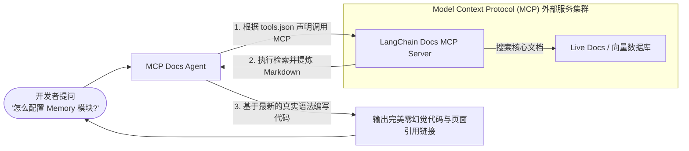

# Deploy MCP Docs Agent - MCP 实时文档检索与零幻觉 Agent 深度剖析

`deploy-mcp-docs-agent` 是一个专注于**抑制大模型幻觉（Hallucination）**的高阶技术示例。该示例展示了如何部署一个针对特定框架（如 LangChain、LangGraph）的实时技术文档检索助手。该 Agent 深度集成了**大模型上下文协议 (Model Context Protocol, MCP)**，能够保证模型在回答技术问题之前，首先通过 MCP 服务对互联网或企业内部的最新的 live docs 进行动态搜索，彻底克服模型固有的知识切断时间（Knowledge Cutoff）瓶颈。

---

## 🎯 核心使用场景与设计目的

在处理日新月异的技术框架或内部 API 开发时，大模型的静态知识往往漏洞百出：
- **API 频繁更新**：两年前的官方语法大模型信手拈来，但到了新版早已废弃，导致输出的代码完全无法编译。
- **信息源混乱**：大模型混合了各种博客的过时教程，无法准确区分哪些是最新的官方实践。

`deploy-mcp-docs-agent` 给出了**协议层数据对齐（MCP Protocol Alignment）**的工业级解答：
1. **Model Context Protocol (MCP)**：将外部知识库（文档搜索引擎、ElasticSearch、数据库）抽象为协议级服务。Agent 无需在代码里对接复杂的向量检索，而是通过统一的 MCP 协议向外部 Server 索要工具。
2. **Workspace-level MCP Registry (工作空间级 MCP 绑定)**：支持将注册好的 MCP 服务（如 LangChain docs mcp）作为 Workspace 级共享资源，在 `tools.json` 中一键声明引用。

---

## 🏗️ 架构与控制流



---

## 💻 核心配置剖析

### 1. 主 Agent 声明式部署文件 (`agent.json`)
```json
{
  "name": "deepagents-deploy-mcp-docs-agent",
  "runtime": {
    "model": {"model_id": "anthropic:claude-sonnet-4-5"}
  }
}
```

### 2. 通过 `deepagents-cli` 物理注册外部 MCP 服务
在 Deep Agents 中，MCP 服务是解耦的、Workspace 级别的基础设施。您只需要在宿主机或云端容器中注册一次即可：
```bash
# 注册名为 docs-langchain 的外部 MCP 服务（它指向 LangChain 官方构建的 MCP 数据源）
deepagents mcp-servers add --url https://docs.langchain.com/mcp --name docs-langchain
```
*提示*：此操作会将该 MCP 服务的端点地址、通信握手凭证固化写入宿主机的全局配置中，供当前工作区的所有 Agent 共享。

### 3. 工具引用声明 (`tools.json`)
一旦全局注册完成，您只需在您的 Agent 项目文件夹下创建一个 `tools.json` 文件，即可声明此 Agent 将获得此 MCP 服务暴露出的所有高阶工具（如 `search_docs`、`fetch_doc_page`）：
```json
[
  {
    "type": "mcp",
    "name": "docs-langchain"
  }
]
```

### 4. 行为准则文件中的检索强制规约 (`AGENTS.md`)
要保证大模型在回答时“百分之百”不靠直觉胡猜，必须在 `AGENTS.md` 中立下不可逾越的技术军规：
```markdown
# 官方技术文档助手行为规范

你是一个严谨的资深技术布道师与架构师。你专职解答关于 LangChain、LangGraph 和 Deep Agents 的高难度编码疑问。

## 严格工作流限制
1. **必先检索，后做解答**：无论面对什么技术提问，你**严禁直接凭空编写代码**。你必须首先调用 `docs-langchain` 提供的搜索工具检索最新的 API 定义。
2. **必须标注文档引用**：在你的最终输出末尾，必须单列一行 `## 参考链接`，列出你刚刚检索时查看的 live docs 的真实 URL 页面链接。
3. **遇到未知勇于承认**：如果 MCP 检索工具没有返回相关的函数定义，说明这是个未公开或已废弃的功能，你必须向用户坦诚说明，严禁胡编（Hallucinate）参数或方法名。
```

---

## 🛠️ 项目实战复用指南

如果您希望在您的企业内部部署一个**针对公司私有产品 API、内部微服务文档的零幻觉智能解答助手**，可以直接复用以下集成方案：

### 1. 私有知识库 MCP 架构布局
```text
enterprise-api-copilot/
├── agent.json               # 部署配置
├── tools.json               # 声明引用内部 API 文档的 MCP 服务
└── AGENTS.md                # 检索优先与参考引用规约
```

### 2. 实战部署与测试步骤

**第一步：基于您的私有文档（如 Gitlab Wiki / Docusaurus），使用标准 Node.js 或 Python 写一个极简的 MCP Server，将其部署在公司内网：**
*例如，您的内部 MCP 运行在 `http://192.168.1.100:3000`，它暴露出了一个工具 `search_internal_api(query: str) -> str`。*

**第二步：将该内部 MCP 服务注册到您的 Deep Agents 基础设施中：**
```bash
deepagents mcp-servers add --url http://192.168.1.100:3000 --name corporate-wiki-server
```

**第三步：在您的项目 `tools.json` 中配置引用：**
```json
[
  {
    "type": "mcp",
    "name": "corporate-wiki-server"
  }
]
```

**第四步：编写高严谨度的主协调 System Prompt 模板 (`AGENTS.md`)：**
```markdown
# 集团内部 API 助手

你是一个精通集团所有内部微服务、数据库表定义的 AI 助理。

## 核心行为
- 接收到有关内部微服务接口（如 "订单服务怎么调用？"）的提问时，立刻调用 `corporate-wiki-server` 下的对应搜索工具。
- 只有在搜索到最新的 Swagger / Protobuf 结构体定义后，方可开始编写代码示例。
- 代码中所有调用的内部域名（如 `service.internal.net`）必须与检索出的文档完全一致。
```

**第五步：一键发布至云端端点，以 API 或 SDK 服务于您的内部 IM：**
```bash
deepagents deploy
```

**复用提示**：
- **MCP 协议的核心优势**：在传统的向量检索（RAG）方案中，您必须自己用 Python 写 `FastAPI + LangChain RetrievalQA + Pinecone` 的复杂代码，并处理分块、重叠、重排序等调优；而在 Deep Agents 架构下，**大模型天然支持 MCP 协议**。一旦 MCP 服务被挂载，大模型自己会分析该服务暴露出了什么搜索工具，它自己会编写工具参数进行检索，免去了开发者写 RAG 检索管线的大量体力活。
