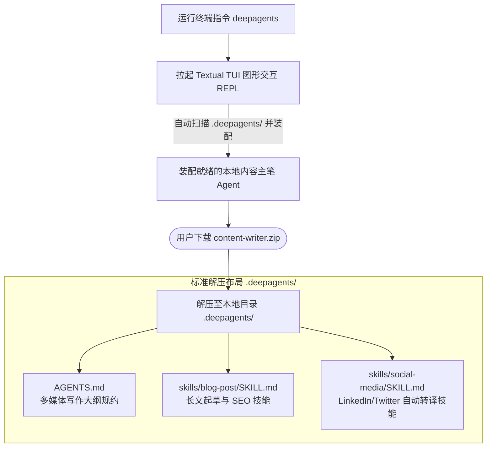

# Downloading Agents - 以“文件夹”为形态的 Agent 打包与即用分发模式深度剖析

`downloading_agents` 是一个展现了 Deep Agents Harness 极具创新性的**分发设计理念（Distribution Philosophy）**的示例。该示例完美地验证了：“**Agent 本质上就是一个物理文件夹**”这一哲学。在 Deep Agents 体系中，一个高级的、具备特定复杂技能的 Agent 可以被物理打包成一个极简的 `.zip` 压缩包。其他开发者下载后，**无需安装任何 Python 依赖、无需编写任何集成代码，直接一键解压并使用 `deepagents-cli` 即可在终端秒级启动一个交互式图形 TUI**。

---

## 🎯 核心使用场景与设计目的

在传统的多 Agent 开发框架（如 AutoGen、LangChain）中，分发和共享一个 Agent 极其痛苦：
- **复杂的 Python 运行环境**：接收方需要安装特定的 SDK 版本，配置各种复杂依赖包，经常因为版本冲突折腾半天。
- **环境安全阻碍**：在不熟悉代码的情况下运行别人的 Agent，接收方极其担心其后台跑恶意代码或随意读写本地磁盘。

`downloading_agents` 提出了**Agent 即文件夹（Folder-as-an-Agent）**的开箱即用设计：
1. **统一的物理约定**：一个完整的 Agent 仅由两部分组成：`AGENTS.md`（角色偏好与大纲指令）和 `skills/`（挂载的业务技能库）。
2. **极简一键运行**：在任何配置了 `deepagents-cli` 的机器上，解压 Agent 压缩包至 `.deepagents/` 目录，执行 `deepagents` 命令，终端即可瞬间弹出一个超炫的 Textual 交互终端（类似于 Claude Code），直接与该 Agent 物理协同。

---

## 🏗️ 架构与控制流



---

## 💻 核心包布局剖析

在这个“免代码（No-Code）”的打包机制中，我们来解剖 `content-writer.zip` 解压后的物理文件形态：

### 1. 主记忆规范文件 (`.deepagents/AGENTS.md`)
```markdown
# 资深全媒体内容主笔规范

你是一个全功能的内容创作 Agent。你可以调用本地文件系统来读取素材，并将写好的文章和推文直接写入磁盘。

## 你的工作职责
- 当用户让你写博客时，你必须调用并遵循 `blog-post` 技能。
- 当用户让你进行社交媒体分发时，你必须调用并遵循 `social-media` 技能。
- 每次写完大作后，你必须自动在本地创建一个 `drafts/` 文件夹，并将输出存为 Markdown 文件。
```

### 2. 局部专有技能 1：长博客起草技能 (`.deepagents/skills/blog-post/SKILL.md`)
```yaml
---
name: blog-post
description: 撰写高质量的行业技术博客。
trigger_on: 撰写博客, 起草技术长文, 行业趋势分析
---
# 博客起草规范

1. **必须包含 SEO Meta**：博客最顶部必须写明 Title, Meta Description 和 Keywords。
2. **三段式结构**：必须包含前言（痛点引入）、正文（核心干货与架构图）、结论（下一步建议）。
3. 语言风格：专业且风趣，使用短句子，避免冗长的废话。
```

### 3. 局部专有技能 2：社交媒体转译技能 (`.deepagents/skills/social-media/SKILL.md`)
```yaml
---
name: social-media
description: 将长文章重构为 LinkedIn 贴文或 Twitter 串（Threads）。
trigger_on: 社交媒体分发, 写推文, 转发 LinkedIn
---
# 社交媒体发布规约

1. **LinkedIn 贴文**：必须带有 3-5 个 Emoji，段落高度分散，末尾带上 3 个行业 Tag。
2. **Twitter 串**：单推严禁超过 280 字符。必须拆分为 3-4 个 Thread 节点，第一条推必须具有极强的 Hook 吸引力。
```

---

## 🛠️ 项目实战复用指南

如果您希望在您的团队内部**快速打包、共享和分发各种特定职能的 Agent 助手（例如：法务审核员、SQL 查询器）**，可以直接复用以下免代码打包与分发流程：

### 1. 构建您自己的“Agent 文件夹”
在本地创建一个工作文件夹，例如 `sql-ninja/`：
```text
sql-ninja/
├── AGENTS.md                 # 注入 DBA 助手的主指令
└── skills/
    ├── schema-checker/
    │   └── SKILL.md          # 挂载表结构校验技能
    └── sql-optimizer/
        └── SKILL.md          # 挂载慢 SQL 优化技能
```

### 2. 将其物理打包
在您的终端中执行以下指令，将其打包为标准分发 Zip：
```bash
zip -r sql-ninja.zip sql-ninja/
```
*提示*：您可以将此 `sql-ninja.zip` 传到公司云盘、内部服务器或 Slack 频道中，供团队成员直接下载。

### 3. 接收端“一键解压并运行”
其他团队成员收到压缩包后，只需执行以下标准“三板斧”指令：

```bash
# 第一步：安装全局 deepagents-cli 工具
uv tool install deepagents-cli

# 第二步：创建目标项目目录并完成 git 初始化
mkdir my-db-project && cd my-db-project && git init

# 第三步：下载您的 zip 并在本地解压为约定好的 '.deepagents' 目录
curl -L http://your-company-nas/agents/sql-ninja.zip -o agent.zip
unzip agent.zip -d .deepagents

# 第四步：瞬间拉起超炫的终端 TUI 运行！
deepagents
```

### 4. 终端 TUI 图形协同界面展示
运行 `deepagents` 后，接收端的终端会呈现如下高质感交互界面：
```text
 ┌──────────────────────────────────────────────────────────────┐
 │  Deep Agents TUI - 'sql-ninja' Active                        │
 ├──────────────────────────────────────────────────────────────┤
 │  [Identity]: 你是一个精通集团所有数据库优化的 DBA 助手。     │
 │  [Skills Loaded]: schema-checker, sql-optimizer              │
 ├──────────────────────────────────────────────────────────────┤
 │  > 请输入您想委托的 DBA 任务...                              │
 │                                                              │
 └──────────────────────────────────────────────────────────────┘
```
**接收方的 Agent 不仅能与用户聊天，还可以读取该工作区 `my-db-project` 下的 SQL 文件并自动帮其重构优化！**

**复用提示**：
- **开发与运行的绝对解耦**：这是 Deep Agents harness 极其高明的设计。作为 Agent 的开发者，您只需要潜心撰写高品质的 Markdown（`AGENTS.md` 和 `SKILL.md`），规范好大模型的行为，就可以将这个 Agent 分发给非程序员或团队内部的其他成员。底层复杂的 Graph 编排、文件读写中间件与云端沙盒执行均由全局的 `deepagents-cli` 承担，最大程度降低了技术摩擦力。
