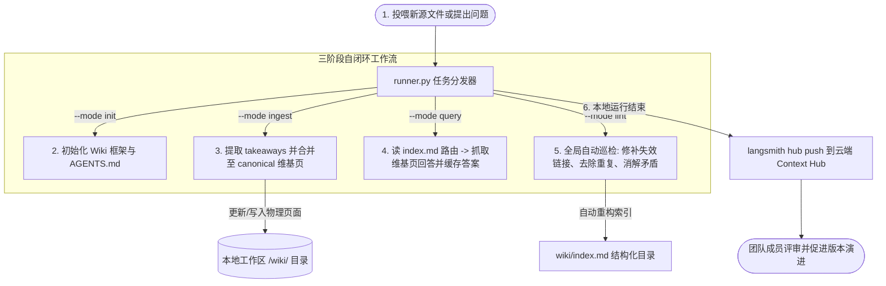

# LLM Wiki - 基于 Context Hub 的增量维基生成与自动巡检 Agent 深度剖析

`llm-wiki` 展现了一个具有颠覆意义的**知识库协同演进（Collaborative Knowledge Evolution）**的工程化设计。该示例通过 `create_deep_agent` 构建了一个知识管理助理，并与 **LangSmith Context Hub** 高度集成。Agent 不是每次都“从零开始”写一份文档，而是以类似软件工程中 Git 开发的模式，通过 **Ingest (数据导入) -> Query (知识检索) -> Lint (自动巡检与去重)** 这三大阶段，像滚雪球一样，将零散的文章和输入源不断打磨、淬炼为一套规整的、带有自动索引的增量式企业级知识维基。

---

## 🎯 核心使用场景与设计目的

在构建企业 Wiki 或团队知识库时，传统的 AI 生成面临两大痛点：
- **知识更新导致内容冲突**：新文件导入后，Agent 可能会写出与旧页面相互矛盾的陈述，导致知识库失去权威性。
- **信息黑盒与无法审计**：无法直观地查看 Agent 在什么时间、根据什么输入、对哪些维基页面做了何种修改。

`llm-wiki` 通过**基于时间线的文件系统日志机制（Durable Git-like Log Timeline）**优雅地给出了工程解答：
1. **Runner-Managed Log (`log.md` 时间线控制)**：Agent 的每一次 Ingest、Query 或 Lint 动作，都会在 `log.md` 中留下一行结构化的、可被 shell 工具分析的 Header（类似于 Git Commit Log），从而能够精准溯源。
2. **Context Hub Sync (同步与版本控制)**：基于 `langsmith hub`，每次运行完毕后，全自动将最新的 Wiki 代码与页面库 Push 到云端的 Context Hub，便于团队评审（Code Review）和历史回滚。

---

## 🏗️ 架构与控制流



---

## 💻 核心逻辑剖析

### 1. Ingest 工作流与 Operator-in-the-Loop 机制
在 `--review` 模式下，Ingest 变为了严谨的双阶段人机协同机制：
- **阶段一 (Read-only Review)**：模型读取 `raw/` 下的新文献，输出 Markdown 格式的“ Takeaways (核心要点)”与“ Proposed Modifications (拟修改建议)”。
- **阶段二 (Write Apply)**：如果操作人员核对后同意，Agent 才会开始对 `/wiki/` 下的词条文件进行真实的写入修改，并由 Runner 将 `ingest.apply | outcome=applied` 追加到日志。

### 2. Lint 自动巡检机制 (`lint.py`)
Lint 模式代表了 Agent 对知识库的**自我净化能力**。其核心代码主要进行以下行为：
```python
def create_lint_agent(model, backend):
    """
    创建一个具备‘自我纠偏’职能的巡检 Agent。
    """
    return create_deep_agent(
        model=model,
        backend=backend,
        memory=["./AGENTS.md"],
        system_prompt=(
            "你是一个极其挑剔的维基百科巡检官（Linter）。\n"
            "你的任务是全面读取 /wiki/ 下的所有 Markdown 页面：\n"
            "1. 检查是否存在死链（Markdown 链接指向了不存在的文件）。\n"
            "2. 检查不同页面之间是否存在陈述冲突（如果 A 页面写 2026年商业化，B 页面写 2028年，指出冲突并根据 log.md 最新信息消解）。\n"
            "3. 检查是否有定义重叠的重复词条，将其合并到一个主词条下，并建立 Redirect 链接。"
        )
    )
```

### 3. Chronological Log (`log.md`) 规范
`log.md` 采用高度规范、极其易于 Grep 分析的标题格式：
```markdown
## [2026-06-02] ingest.apply | outcome=applied source=notes/ada.md
- **Timestamp (UTC)**: 04:52:10
- **Summary**: 合并了阿达·洛芙莱斯关于分析机的最新构想笔记。更新了 `/wiki/analytical_engine.md` 词条，增加了 3 条参考链接。
```
这能让开发者直接使用最原始的 Shell 脚本，一秒统计出 Agent 的全部生存痕迹：
```bash
# 查询所有的 Ingest 导入成果
grep "ingest.apply | outcome=applied" log.md
```

---

## 🛠️ 项目实战复用指南

如果您在为您的企业开发一套**增量式、具备自动修正能力的私有知识库引擎**（例如：API 知识中心、研发避坑指南），可以直接复用以下 Ingest-Apply 骨架代码：

```python
# file: custom_wiki_engine.py
import os
from datetime import datetime
from deepagents import create_deep_agent
from deepagents.backends import FilesystemBackend
from langchain_anthropic import ChatAnthropic

class WikiEngine:
    def __init__(self, workspace_path: str):
        self.workspace = workspace_path
        self.backend = FilesystemBackend(root_dir=workspace_path)
        self.model = ChatAnthropic(model="claude-sonnet-4-6", temperature=0.0)
        
        # 初始化物理结构
        os.makedirs(os.path.join(workspace_path, "wiki"), exist_ok=True)
        os.makedirs(os.path.join(workspace_path, "raw"), exist_ok=True)
        
        # 初始化主大纲
        self.agents_md_path = os.path.join(workspace_path, "AGENTS.md")
        if not os.path.exists(self.agents_md_path):
            with open(self.agents_md_path, "w") as f:
                f.write("# 企业 Wiki 维护大纲\n确保知识绝对客观，严禁胡编。")

    def run_ingest(self, source_filename: str):
        """
        数据导入模式：读取 raw/ 文件夹，并将其内容融汇提炼为维基百科格式的知识文件
        """
        agent = create_deep_agent(
            model=self.model,
            backend=self.backend,
            memory=["./AGENTS.md"],
            system_prompt=(
                "你是一个维基高级主笔。\n"
                "用户投喂了一篇原始材料。你必须：\n"
                "1. 将其分析、重构并整合进 `/wiki/` 下对应的概念文件中（如果没有，就新建文件）。\n"
                "2. 严禁直接大段复制。你必须以维基百科的客观学术口吻进行改写。"
            )
        )
        
        print(f"[Engine] 正在导入源文件: {source_filename}")
        # 调用大模型执行增量导入
        agent.invoke({
            "messages": [("user", f"请读取 /raw/{source_filename}，将其增量合并进我们的维基库。")]
        })
        
        # 写入物理 log.md 
        log_path = os.path.join(self.workspace, "log.md")
        date_str = datetime.now().strftime("%Y-%m-%d")
        time_str = datetime.now().strftime("%H:%M:%S")
        
        log_entry = (
            f"\n## [{date_str}] ingest.apply | outcome=applied source={source_filename}\n"
            f"- **Timestamp (UTC)**: {time_str}\n"
            f"- **Summary**: 增量合并了新知识点，已更新 Wiki 页面。\n"
        )
        
        with open(log_path, "a") as lf:
            lf.write(log_entry)
        print("[Engine] Ingest 导入成功，日志已记录。")

if __name__ == "__main__":
    # 使用指南
    workspace_dir = "./corp_wiki"
    
    # 模拟在 raw 下放置一篇原始资料
    os.makedirs(os.path.join(workspace_dir, "raw"), exist_ok=True)
    with open(os.path.join(workspace_dir, "raw/solid_battery.txt"), "w") as sf:
        sf.write("固态电池采用固态电解质，能量密度比液态锂电池高一倍，但目前面临循环寿命差和成本高的问题。")
        
    engine = WikiEngine(workspace_dir)
    engine.run_ingest("solid_battery.txt")
```

**复用提示**：
- **Context Hub 的重大商业价值**：传统的 RAG 技术只能回答问题，知识库本身是死的；而引入 Wiki Ingest-Lint 架构后，**AI Agent 变成了知识的共同创作者**。它能够把员工零散的工作报告、踩坑记录自动分类、打标、去重、关联，在本地或 Context Hub 上自动维护起一套极其规整的知识维基，为公司的数字资产沉淀提供了全自动方案。
