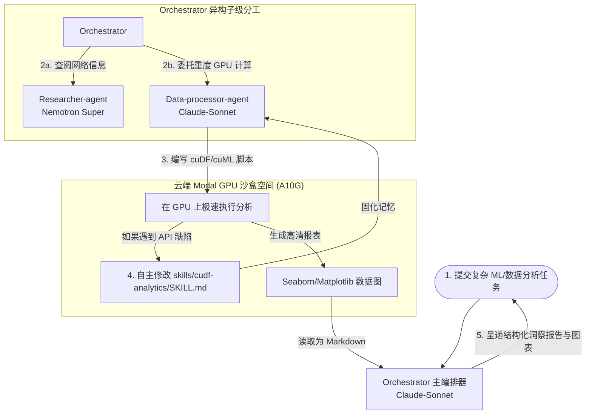

# Nemotron Deep Agent - 异构多模型分工与 GPU 沙盒物理分析 Agent 深度剖析

`nvidia_deep_agent` 展现了 Deep Agents Monorepo 中极具震撼力的**企业级高性能数据智能（High-Performance Data Intelligence）**设计方案。该示例完美演示了如何通过异构模型分工，驱动一个拥有 **GPU 加速代码执行沙盒（Modal GPU Sandbox）** 的超级分析助理。主策略模型采用旗舰推理模型进行逻辑流调控，检索委托给专门优化过的 `NVIDIA Nemotron Super`，而重度数据分析与机器学习算法则由挂载了 `NVIDIA RAPIDS (cuDF, cuML)` GPU 加速技能的 Data Processor Agent 在 Modal 云端容器中以极速运行。

---

## 🎯 核心使用场景与设计目的

在处理百万行级别的 CSV 分析、复杂机器学习建模或大规模可视化时，普通的 AI Agent 面临三大技术屏障：
- **CPU 算力与内存瓶颈**：大模型编写出的 Python Pandas 脚本在处理大数据时会因为内存溢出（OOM）或 CPU 跑满而直接崩溃。
- **静态工具集受限**：大模型无法仅靠“内置工具”处理定制化的复杂机器学习算法。
- **遇到限制无法自我纠偏**：如果模型在写代码时用到了不支持的 API，通常会反复重试同一行错误，导致死锁。

`nvidia_deep_agent` 给出了**算力硬件重塑（Hardware-Accelerated Agent Sandbox）**的先进工程化回答：
1. **Modal GPU Sandbox (A10G 物理容器)**：系统会在 Modal 上全自动拉起一个挂载了 NVIDIA A10G GPU、预装了 cuDF / cuML 的 A10G 物理沙盒，Agent 在其中可以直接以 GPU 算力跑数。
2. **Self-Improving Memory (技能自我改进机制)**：当 Data Processor 遇到 API 局限（例如发现 `cuml` 某个算法不支持特定参数）时，它会**自主调用物理修改工具更新沙盒内的 `SKILL.md` 文档**。下一轮运行时，模型读到自己改写的 SKILL 文档，便会规避此陷阱，实现真正的“吃一堑长一智”。

---

## 🏗️ 架构与控制流



---

## 💻 核心配置与代码剖析

### 1. 异构模型与子级 Agent 注册 (`agent.py`)
在初始化 `create_deep_agent` 时，Orchestrator 选用 Claude 3.5 Sonnet 负责控制流，而检索副手则选用 NVIDIA 官方的 Nemotron 3 Super，Data Processor 挂载专有的 `/skills/` 物理路径：
```python
from deepagents import create_deep_agent
from langchain.chat_models import init_chat_model
from langchain_nvidia_ai_endpoints import ChatNVIDIA

# 1. 主策略模型 (Claude 3.5 Sonnet)
frontier_model = init_chat_model("anthropic:claude-sonnet-4-6")

# 2. 专职检索模型 (NVIDIA Nemotron Super)
nemotron_super = ChatNVIDIA(model="nvidia/nemotron-3-super-120b-a12b")

# 3. 注册带有特定 Skills 的物理数据处理副手
data_processor_sub_agent = {
    "name": "data-processor-agent",
    "description": "专职负责 GPU 加速的数据分析、可视化与机器学习训练。",
    "system_prompt": "你是一个顶级数据科学家，你只编写高效的 cuDF 和 cuML 代码。",
    "tools": [tavily_search],
    "model": frontier_model,
    "skills": ["/skills/"] # 挂载沙盒内的 GPU 技能文档
}

# 4. 装配全局 Agent
agent = create_deep_agent(
    model=frontier_model,
    system_prompt="你是一个高阶商业综合编排官...",
    subagents=[researcher_sub_agent, data_processor_sub_agent],
    memory=["/memory/AGENTS.md"],
    backend=create_backend, # 自定义 Modal GPU 后端
    context_schema=Context  # 允许运行时在 CPU/GPU 容器间秒级热切换
)
```

### 2. cuDF 加速分析技能规范 (`skills/cudf-analytics/SKILL.md`)
向 Data Processor 注入的技能书非常具体，教会它如何将 Pandas 习惯无缝迁移到 GPU 加速的 cuDF 库上：
```yaml
---
name: cudf-analytics
description: 使用 NVIDIA cuDF 库进行 GPU 加速的表格分析。
trigger_on: 跑数据统计, 异常检测, 大文件 CSV 读取, Groupby 聚合
---
# GPU 数据分析技能书

当你需要处理大数据表格时，优先编写 cuDF 代码。

## cuDF 语法规范
1. **导入库**：必须导入 `cudf`，而不是传统的 `pandas`。
   ```python
   import cudf
   ```
2. **高速读取**：使用 `cudf.read_csv` 将数据直接加载进显存中。
3. **数据加工**：在 GPU 上执行 groupby 聚合操作，这比 Pandas 快 50-100 倍。
   ```python
   gdf = cudf.read_csv('big_data.csv')
   summary = gdf.groupby('category').mean()
   print(summary)
   ```
4. **已知限制（记忆自我写入区）**：
   - *（如果大模型在运行中发现某个 API 报错，它会自动往这一节下面写，供下次参考）*
```

---

## 🛠️ 项目实战复用指南

如果您在为您的企业开发**高吞吐量的数据分析中台、智能报表生成系统或 AI 自动调参建模平台**，可以直接复用以下 GPU 物理沙盒的调度和集成结构：

### 1. 本地项目结构
```text
gpu-analyst-bot/
├── src/
│   ├── agent.py             # 异构模型装配
│   ├── backend.py           # Modal 物理沙盒创建与文件挂载
│   └── prompts.py           # 商业分析与数据处理 System Prompt
└── skills/
    ├── cudf-analytics/
    │   └── SKILL.md         # cuDF 技能书
    └── cuml-machine-learning/
        └── SKILL.md         # cuML 机器学习技能书
```

### 2. Modal GPU 后端定义参考模板 (`backend.py`)
如何使用 Modal API 编写一个为 Deep Agent 动态拉起 GPU 容器的后端：

```python
# file: custom_modal_backend.py
import os
from deepagents.backends import StateBackend
from deepagents.backends.protocol import SandboxBackendProtocol

class CustomModalSandboxBackend(StateBackend, SandboxBackendProtocol):
    """
    自研的云端 Modal 物理隔离 GPU 执行后端。
    它不仅提供状态存储，还实现了 Sandbox 协议，允许大模型在 GPU Docker 容器中执行任意指令。
    """
    def __init__(self, use_gpu: bool = True):
        super().__init__()
        self.use_gpu = use_gpu

    def create_sandbox(self, sandbox_id: str, setup_script_path: str = None):
        """
        全自动拉起云端容器。
        """
        import modal
        
        # 1. 声明 Docker 镜像环境（预装 CUDA 驱动和常用的科学计算库）
        image_name = "rapidsai/rapidsai:23.10-cuda11.8-py3.10" if self.use_gpu else "python:3.10-slim"
        
        print(f"[Modal Sandbox] 正在为您拉起云端环境. 镜像: {image_name}")
        stub = modal.Stub("agent-sandbox")
        
        # 2. 如果启用 GPU，选用性价比极高的 NVIDIA A10G 显卡
        gpu_config = "A10G" if self.use_gpu else None
        
        # 3. 启动并挂载本地项目文件（这会让大模型在沙盒内看到您的 skills/ 目录）
        # 返回容器的句柄，供 FilesystemMiddleware 进行工具级的映射
        return stub.spawn_container(
            image=modal.Image.from_registry(image_name),
            gpu=gpu_config,
            timeout=3600
        )

def create_backend(context):
    """
    提供给 create_deep_agent 的工厂函数，能够根据运行时用户传入的 Context，
    自由热切换 GPU / CPU 环境。
    """
    sandbox_mode = context.get("sandbox_type", "gpu")
    return CustomModalSandboxBackend(use_gpu=(sandbox_mode == "gpu"))
```

### 3. 多模型并发调用实例
```python
# file: run_gpu_bot.py
import asyncio
from src.agent import agent

async def main():
    # 模拟用户任务，让 Agent 生成 50 万行随机订单数据，并使用 cuDF 进行 Groupby 分析，生成一张 Seaborn 数据图
    prompt = (
        "利用你的 cudf 技能，在沙盒中快速生成 500,000 行的模拟订单 CSV 表格 "
        "(包含订单号、销售额、省份、时间)。然后使用 cuDF 极速统计出各个省份的销售总额，"
        "并用 matplotlib 画一张柱状图，将图片保存在 /workspace/sales.png。"
    )
    
    # 传入运行时上下文，明确要拉起云端 GPU 沙盒
    result = await agent.ainvoke(
        {"messages": [("user", prompt)]},
        context={"sandbox_type": "gpu"} # 热切换至 GPU 沙盒
    )
    
    print("\n--- 大模型执行结果 ---")
    print(result["messages"][-1].content)

if __name__ == "__main__":
    asyncio.run(main())
```

**复用提示**：
- **自我进化记忆的价值**：这是整个 monorepo 中最令人兴奋的技术细节之一。在传统 Agent 中，如果代码因为某个版本库 API 变动发生报错，它会卡死在同一个 Bug 里直到退出运行；而 `nvidia_deep_agent` 引入的 Self-Improving Memory 机制让 Agent 在失败中不断完善自身的 SKILL.md 文档，从而在多次迭代中成长为一个对您业务框架细节掌握得越来越完美的终极数据分析大杀器。
