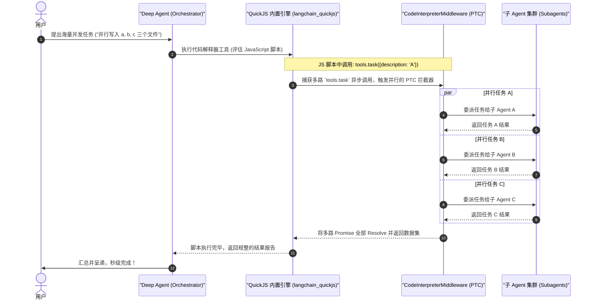

# REPL Swarm - QuickJS 异步多并发与 JavaScript/TypeScript 技能深度剖析

`repl_swarm` 展现了 Deep Agents monorepo 中极具黑客硬核美感的**高并发任务扇出（High-Concurrency Swarm Fan-out）**设计。该示例的核心是引入了 **`langchain_quickjs`** 运行时，并在 Deep Agent 内部注册了 `CodeInterpreterMiddleware`。这让大模型具备了在物理沙盒中执行 **JavaScript/TypeScript 异步代码** 的能力。当面临需要并发处理的庞大任务（例如：并行分析 10 个数据文件）时，大模型不再是老老实实写一堆 Python 串行循环，而是**直接在内置的 QuickJS 沙盒中通过 `Promise.all` 配合 `tools.task(...)` 工具异步高并发拉起一整个子 Agent 蜂群（Swarm）**。

---

## 🎯 核心使用场景与设计目的

传统的串行 Agent 在面对多任务分发时，会遇到两大无法逾越的性能死角：
- **串行延迟**：大模型需要执行 5 个独立的子课题。如果使用 Python 串行调度，Orchestrator 必须经历 5 次完整的“大模型思考 -> 调用工具 -> 收到结果 -> 下一轮思考”的迭代循环，时间通常消耗几分钟。
- **并发控制摩擦力**：虽然 Python 有 `asyncio.gather`，但在单纯的大模型 Planner 体系中，让模型“自主分析并动态写出并行的 Python 协程代码”极其困难，且容易写出死锁或语法报错。

`repl_swarm` 给出了一套**协议化 JavaScript 并行网关（PTC - Parallel Tool Calling）**的极致性能方案：
1. **Parallel Tool Calling (PTC)**：指定特定的工具（如 `task` 任务委派工具）为可并行工具。大模型在 QuickJS 中只需写一句极为符合现代 JS 习惯的 `await Promise.all(tasks.map(t => tools.task(t)))`，底层的中间件就会自动将其拆分为并发的多路子图运行。
2. **TypeScript 技能编写**：将复杂的“蜂群调度算法”固化写入 `skills/swarm/index.ts` 中。对于大模型来说，这个高级技能只是一个标准的 ES Module。大模型只需在 REPL 中调用 `runSwarm(...)`，其余复杂的并发限制、状态轮询与熔断逻辑全部被屏蔽在 TypeScript 技能的物理源码中。

---

## 🏗️ 架构与控制流



---

## 💻 核心代码剖析

### 1. 挂载 QuickJS 运行时与并发工具指定
在 `swarm_agent.py` 中，通过在 `middleware` 列表中挂载 `CodeInterpreterMiddleware` 并设定 `ptc=["task"]`，一键开启了 `task` 工具的并发执行能力：
```python
from pathlib import Path
from deepagents import create_deep_agent
from deepagents.backends import CompositeBackend, FilesystemBackend, StateBackend
from langchain_quickjs import CodeInterpreterMiddleware

SKILLS_DIR = str(Path(__file__).parent / "skills")

def _build_agent(model: str):
    # 1. 建立混合存储：/skills/ 映射到物理本地，保障 SkillsMiddleware 可读；其余数据落地 StateBackend
    skill_backend = FilesystemBackend(root_dir=SKILLS_DIR, virtual_mode=True)
    backend = CompositeBackend(
        default=StateBackend(),
        routes={"/skills/": skill_backend},
    )
    
    # 2. 核心装配
    return create_deep_agent(
        model=model,
        backend=backend,
        skills=["/skills/"], # 挂载 JS/TS 编写的 Swarm 技能夹
        middleware=[
            CodeInterpreterMiddleware(
                ptc=["task"],       # 声明当 JS 代码中遇到 tools.task 时，作为并行工具调用 (PTC)
                skills_backend=backend,
                timeout=None,
            )
        ],
    )
```

### 2. TypeScript 蜂群技能实现 (`skills/swarm/index.ts`)
大模型加载的技能不仅仅是文本，而是一个可在沙盒里运行的 TS 脚本。让我们来看看 `skills/swarm/index.ts` 是如何通过极其优雅的异步控制流，帮助大模型屏蔽复杂的并发实现的：
```typescript
/**
 * 蜂群高并发任务委派算法。
 * 接收一系列子课题，在 QuickJS 沙盒中并发启动 tools.task 并收集结果。
 */
export async function runSwarm(tasks: { description: string }[]): Promise<any[]> {
  console.log(`[Swarm Skill] 正在启动蜂群。任务数: ${tasks.length}`);
  
  // 1. 利用标准 ES 异步映射，拉起多路异步子任务
  const promises = tasks.map(async (task, index) => {
    try {
      console.log(`[Swarm Skill] 正在委派子任务 ${index + 1}: ${task.description}`);
      // 物理触发底层的并行的 tools.task 中间件拦截器
      const result = await globalThis.tools.task({
        subagent_type: "general-purpose",
        description: task.description
      });
      return { success: true, description: task.description, result };
    } catch (error) {
      return { success: false, description: task.description, error: String(error) };
    }
  });

  // 2. 并发合并，收集所有的 Promise
  return Promise.all(promises);
}
```

---

## 🛠️ 项目实战复用指南

如果您在您的企业项目中，需要开发一个**超快响应、能够在一瞬间完成大量子课题拆解、检索与并行的 Agent 系统**（例如：秒级提取 20 张图片中的文字并翻译），可以直接复用以下 PTC 扇出集成骨架：

### 1. 并行 Swarm 项目文件结构
```text
high-speed-swarm/
├── run_swarm.py             # Python 主驱动，注入 CodeInterpreter 插件
└── skills/
    └── my-swarm/
        ├── SKILL.md         # 技能大纲，告知大模型如何 await import("@/skills/my-swarm")
        └── index.ts         # 实战 TS 并发逻辑
```

### 2. TS 并发核心脚本模板 (`skills/my-swarm/index.ts`)
```typescript
// file: skills/my-swarm/index.ts
export async function dispatchParallelWorks(queries: string[]): Promise<string[]> {
  console.log("[Swarm] 开始多并发分发...");
  
  // 大模型调用此 TS 函数后，底层 QuickJS 运行时会瞬间并行拉起多个 tools.task
  const tasks = queries.map(q => globalThis.tools.task({
    subagent_type: "general-purpose",
    description: `专门调查这个细节: ${q}`
  }));
  
  return Promise.all(tasks);
}
```

### 3. 主 Python Agent 挂载与调用
```python
# file: run_swarm.py
import os
import asyncio
from pathlib import Path
from deepagents import create_deep_agent
from deepagents.backends import FilesystemBackend
from langchain_quickjs import CodeInterpreterMiddleware
from langchain_anthropic import ChatAnthropic

async def run_parallel_job():
    base_dir = os.path.dirname(os.path.abspath(__file__))
    model = ChatAnthropic(model="claude-sonnet-4-6", temperature=0.0)
    backend = FilesystemBackend(root_dir=base_dir)
    
    # 装配带有 PTC (Parallel Tool Calling) 的极速 Agent
    fast_agent = create_deep_agent(
        model=model,
        backend=backend,
        skills=["/skills/"],
        middleware=[
            CodeInterpreterMiddleware(
                ptc=["task"], # 强制指定 task 为并行工具
                skills_backend=backend
            )
        ],
        system_prompt=(
            "你是一个高速并行计算指挥官。\n"
            "当你遇到大批量的重复提取、校验、调查类任务时：\n"
            "1. 必须使用 `await import('@/skills/my-swarm')` 载入 TS 技能。\n"
            "2. 调用 `dispatchParallelWorks([q1, q2, q3])` 并发启动处理，严禁写串行的 Python 循环！"
        )
    )
    
    user_task = "并行提取并对比 A、B、C 三家新能源汽车品牌的 2026 最新续航里程数据。"
    print(f"[Orchestrator] 正在派发需求: {user_task}")
    
    # ainvoke 是必须的，这能让 QuickJS 工具流在调用者的异步线程上下文中平滑运行
    result = await fast_agent.ainvoke({
        "messages": [("user", user_task)]
    })
    
    print("\n--- 最终合并报告 ---")
    print(result["messages"][-1].content)

if __name__ == "__main__":
    # 确保设置了 API Key
    asyncio.run(run_parallel_job())
```

**复用提示**：
- **超凡的性能跨越**：普通的 AI 助理在面临对比多份文件时，往往要花费 2-3 分钟在串行迭代上；而引入 QuickJS PTC 拦截器后，大模型在一秒内写好 JS 脚本，底层 Graph 瞬间扇出多路 HTTP 协程，在 10 秒内即可同时收集完 5-10 个子任务的结论。这对于对 INP (Interaction to Next Paint) 响应要求极高的商业 Web Agent 来说，是绝对的核心降迟手段。
