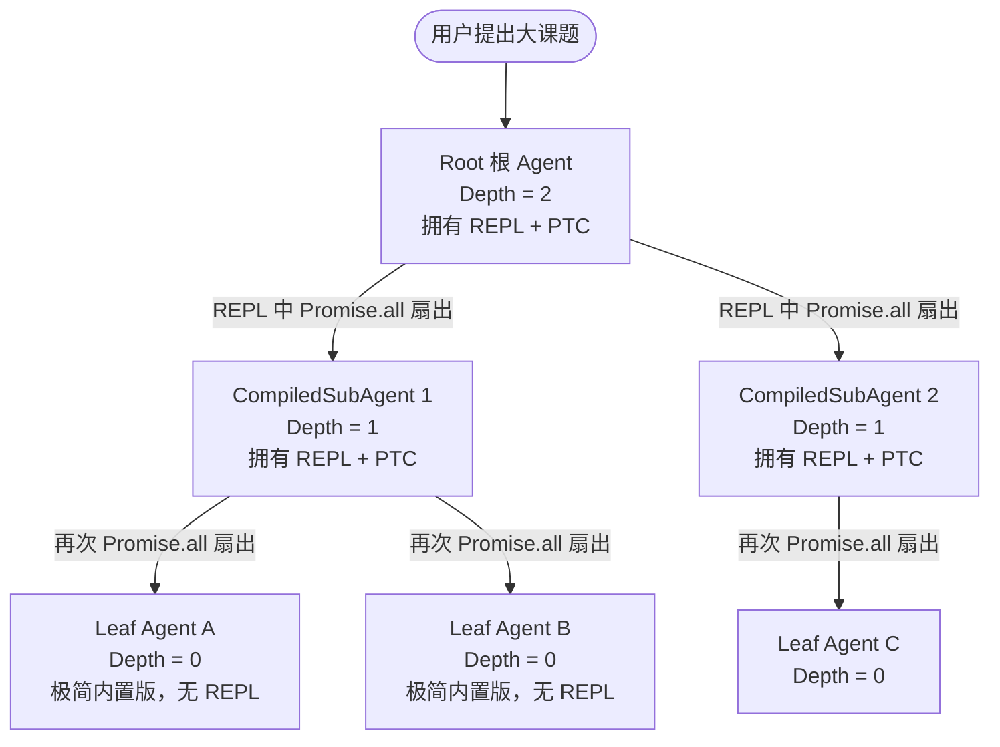

# Recursive REPL Mode (RLM) - 递归嵌套与 PTC 树状扇出 Agent 深度剖析

`rlm_agent` 是 Deep Agents monorepo 中理论深度最高、最具黑客前瞻性的**递归 Agent 级联（Recursive Agent Cascading）**示例。该示例提供了一个强大的高阶封装函数 `create_rlm_agent`。它不仅为主 Agent 注入了 `CodeInterpreterMiddleware` (QuickJS REPL 运行时)，更是通过将默认的同步 `general-purpose` 子级 Agent 巧妙地替换为深度为 (N-1) 的 **CompiledSubAgent**，实现了物理级的**深度递归嵌套结构**。模型在 REPL 中调用 `Promise.all` 调用子 Agent 时，子级本身又是一个拥有完整 REPL 并能再次并发嵌套扇出的独立图，直到递归深度降为 0，触底收敛。

---

## 🎯 核心使用场景与设计目的

在面对**高度不确定、且具备多级嵌套拆解属性的复杂大型任务**（例如：“帮我编写并测试一个完整的复杂 Python 编译器，包含词法分析器、语法分析器、代码生成器，且这三个模块每一个都需要再向下进行详细的子模块设计与单元测试”）时：
- **扁平化的 Swarm 局限**：一层的 Swarm (蜂群) 只能做一级的扁平化拆解，无法应对“子任务本身也是一个极其庞大、需要再次拆解的大任务”的树状分裂结构。
- **内存爆炸与混乱**：如果所有的拆解子任务都在同一个大图和同一个上下文里执行，各级变量会疯狂污染，导致模型注意力迅速崩溃。

`rlm_agent` 依靠**物理嵌套图隔离（Compiled State Graph Isolation）**给出了优雅的技术解：
1. **Depth-cascading Compiled Graph (深度级联编译图)**：每一层递归并不是图结构上的简单循环，而是一个独立编译、物理隔离的全新 `CompiledStateGraph`。这意味着子级 Agent 内部的局部变量、TodoList 和临时文件绝不会污染上一层父级 Agent。
2. **PTC (Parallel Tool Calling) 树状扇出**：每一层都具有 `CodeInterpreterMiddleware`，允许模型通过 `Promise.all` 扇出。这能让整个 Agent 算力以极快的速度分裂为一棵“并行计算树”，在极短时间内对庞大的项目进行地毯式的同步开发与自检。

---

## 🏗️ 架构与控制流



---

## 💻 核心逻辑剖析

### 1. 递归构建器核心实现 (`rlm_agent.py`)
`create_rlm_agent` 核心代码展示了如何在底层通过闭包和深度缩减（Depth Reduction）递归组装物理图：
```python
from typing import Any
from deepagents import create_deep_agent
from deepagents.middleware.subagents import GENERAL_PURPOSE_SUBAGENT, CompiledSubAgent
from langchain_quickjs import CodeInterpreterMiddleware

_MAX_DEPTH_LIMIT = 8 # 递归深度安全阀，防止因死循环写垮服务器

def create_rlm_agent(model: str, max_depth: int = 1, tools: list = None, **kwargs: Any):
    """
    递归装配带有深度隔离的 RLM Agent 实例。
    """
    if max_depth < 0 or max_depth > _MAX_DEPTH_LIMIT:
        raise ValueError(f"不合法的递归深度: {max_depth}")
        
    return _build_recursive_node(
        model=model,
        tools=tools or [],
        max_depth=max_depth,
        **kwargs
    )

def _build_recursive_node(model: str, tools: list, max_depth: int, **kwargs: Any):
    # 阶段一：当递归触底 (Depth = 0) 时，只装配最底层的内置 general-purpose 子级，终止无限分裂
    if max_depth == 0:
        ptc_tool_names = sorted({*(t.name for t in tools), "task"})
        return create_deep_agent(
            model=model,
            tools=tools,
            middleware=[CodeInterpreterMiddleware(ptc=ptc_tool_names)],
            **kwargs
        )

    # 阶段二：当 Depth > 0 时，首先向下编译一个深度为 (max_depth - 1) 的独立 Agent 实例
    deeper_agent = _build_recursive_node(
        model=model,
        tools=tools,
        max_depth=max_depth - 1,
        **kwargs
    )
    
    # 将这个更深层级的 Compiled 实例，打包为名为 'general-purpose' 的 CompiledSubAgent
    compiled_gp_subagent = CompiledSubAgent(
        name=GENERAL_PURPOSE_SUBAGENT["name"],
        description=GENERAL_PURPOSE_SUBAGENT["description"],
        runnable=deeper_agent # 递归级联核心：将更深层的 runnable 图挂在子级接口上
    )
    
    # 组装本层 Agent，挂载上述已编译好的子级
    ptc_tool_names = sorted({*(t.name for t in tools), "task"})
    return create_deep_agent(
        model=model,
        tools=tools,
        subagents=[compiled_gp_subagent], # 注册编译好的级联子 Agent
        middleware=[CodeInterpreterMiddleware(ptc=ptc_tool_names)],
        **kwargs
    )
```

---

## 🛠️ 项目实战复用指南

如果您在为您的企业开发**超大型自动化规划系统（如：自动编写整套企业合规审计报告，且每章、每节都需要自动拉起细分领域的 Agent 开展深度起草与校验）**，可以直接复用以下 RLM 架构和调度模式：

### 1. 递归 RLM 极简调用实例

```python
# file: run_rlm_framework.py
import asyncio
from rlm_agent import create_rlm_agent
from langchain_core.tools import tool

# 1. 声明一个简单的局部求和计算工具（可以被 PTC 并发调用）
@tool
def calculate_salary(employee_id: str, base: int, bonus: int) -> int:
    """计算单名员工的真实薪酬总额。"""
    print(f"[Tool] 正在物理计算员工 {employee_id} 的薪酬...")
    return base + bonus

async def run_recursive_calculation():
    # 2. 一键创建深度为 1 的递归 REPL Agent 实例
    # 选用 Claude 3.5 Haiku 以保障极佳的 PTC JS 语法编写能力与超低调用成本
    rlm_agent = create_rlm_agent(
        model="anthropic:claude-haiku-4-5",
        tools=[calculate_salary],
        max_depth=1 # 允许进行 1 层深度级联（Root -> GP Subagent -> Leaf）
    )
    
    # 3. 投喂一个需要拆解的并行任务
    prompt = (
        "使用你的 JS REPL，并行计算员工 E001 (base:10000, bonus:2000)、"
        "E002 (base:12000, bonus:3000) 和 E003 (base:15000, bonus:4000) 的薪酬。\n"
        "请在 `eval` 工具的 JS 脚本中，直接调用 `tools.calculate_salary` 并使用 `Promise.all` 扇出，"
        "最终向我汇报总金额。"
    )
    
    print("[Root] 正在启动 RLM 并行计算树...")
    # 物理触发 high-speed 递归流
    result = await rlm_agent.ainvoke({
        "messages": [("user", prompt)]
    })
    
    print("\n--- 最终计算输出 ---")
    print(result["messages"][-1].content)

if __name__ == "__main__":
    asyncio.run(run_recursive_calculation())
```

**复用提示**：
- **递归深度的理性选择**：在绝大多数实际商业项目中，`max_depth=1` 或 `max_depth=2` 已是性能与推理的极限上限。大于 2 的递归会导致调用层级过深，极易因为底层的某一路网络抖动造成整棵计算树崩溃。如果您的任务需要进行 3 级以上的树状拆解，强烈建议重新优化大纲，将长任务切分为在 Ralph 模式下的多个独立子循环。
- **状态不共享红线**：由于每一层 RLM 都是独立的物理 Compiled State Graph，**它们之间绝不共享局部状态与中间变量**。子 Agent 的所有输出只能通过 `calculate_salary` 的返回值，或者 `tools.task` 调用的描述字段传递回上一级 Orchestrator。
