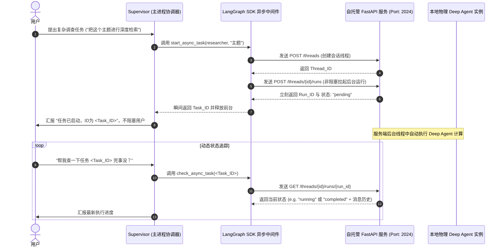

# Async Subagent Server - 自托管 FastAPI Agent Protocol 与异步子级服务深度剖析

`async-subagent-server` 展现了 Deep Agents Monorepo 中极具工业级实用价值的**分布式微服务架构（Distributed Microservices Architecture）**设计。该示例通过双端模式（FastAPI 服务端 `server.py` + Supervisor 交互终端 `supervisor.py`），完美验证了如何脱离 LangSmith Platform 等托管服务，**完全从零使用 Python FastAPI 框架自托管一个遵循官方 Agent Protocol 规范的微服务节点**，并将其作为 Asynchronous Subagent (异步子 Agent) 挂载至您的本地主策略协调器中。

---

## 🎯 核心使用场景与设计目的

在构建大型企业级 Agent 系统时，将所有的 Agent 图结构集中部署在同一个物理进程或托管空间，通常会面临三大屏障：
- **物理资源冲突**：有些特殊的 Agent 必须运行在特定的局域网环境、或者需要挂载特殊的数据库、高配物理显卡；而主 Orchestrator 只需要轻量级的 CPU 节点。
- **高并发阻塞**：如果一个长周期重度耗时的子任务（如 "爬取 100 个网页并做数据规整"）阻塞在前台，主服务进程的吞吐量会急剧下降。
- **异构技术栈阻碍**：团队可能希望用 Python 写主要的协调逻辑，而用 Node.js 或 Go 来运行特定的子 Agent 算力。

`async-subagent-server` 依靠**微服务解耦与标准 API 握手（Microservice Decoupling via Agent Protocol）**完美给出了解决方案：
1. **FastAPI Agent Protocol Core (自托管 API 端点)**：服务端遵循标准 Agent 规范暴露接口，主 Orchestrator 在调用异步子级时，后台自动分发 HTTP 协程，实现跨网络的“轮询”与“非阻塞控制”。
2. **Supervisor Async Orchestration (微服务主控)**：主 Agent 仅需在 `subagents` 列表中声明子级的 IP 地址和自定义握手鉴权头，即可自动在本地激活 `start_async_task`、`check_async_task` 等标准后台调度工具。

---

## 🏗️ 架构与控制流



---

## 💻 核心接口设计剖析

为了完美对接 Deep Agents Harness 的异步中间件，自托管的 FastAPI 服务端必须实现以下四类规范接口：

| 请求方法 | API 物理路由端点 | 作用与中间件对接原理 |
| :--- | :--- | :--- |
| **POST** | `/threads` | 创建一个新的线程会话。对应 `start_async_task` 的初始化动作。 |
| **POST** | `/threads/{thread_id}/runs` | 在指定线程上非阻塞启动大模型 Run 运行流。在后台拉起 asyncio 任务。 |
| **GET** | `/threads/{thread_id}/runs/{run_id}` | 轮询当前任务的实时执行状态（pending, running, completed, failed）。 |
| **GET** | `/threads/{thread_id}` | 获取线程的最新 State。返回大模型最新的 `values.messages` 消息数组。 |
| **POST** | `/threads/{thread_id}/runs/{run_id}/cancel` | 物理中断当前正在后台计算的任务。对应 `cancel_async_task`。 |

---

## 🛠️ 项目实战复用指南

如果您希望在公司内网**快速自托管一套高可用、遵循标准协议的 Agent 微服务节点**，可以直接复用以下精简的 FastAPI 服务端模板：

### 1. 自托管 Agent 微服务骨架 (`microservice_server.py`)

```python
# file: microservice_server.py
import uvicorn
import uuid
from fastapi import FastAPI, HTTPException, Header
from pydantic import BaseModel
from typing import Dict, Any, List
from deepagents import create_deep_agent
from langchain_anthropic import ChatAnthropic

app = FastAPI(title="Corporate Agent Protocol Node")

# 1. 初始化您私有的物理 Agent 实例
# 它可以配置公司内网的专有数据库或工具
_agent = create_deep_agent(
    model=ChatAnthropic(model="claude-sonnet-4-6"),
    system_prompt="你是一个自托管的企业内部报销数据审计助理。"
)

# 内存数据存储（在生产中，请替换为 Redis 或 PostgreSQL）
THREADS_DB: Dict[str, Dict[str, Any]] = {}
RUNS_DB: Dict[str, Dict[str, Any]] = {}

class ThreadCreateRequest(BaseModel):
    metadata: Dict[str, Any] = {}

class RunCreateRequest(BaseModel):
    assistant_id: str
    input: Dict[str, Any]

@app.post("/threads")
async def create_thread(req: ThreadCreateRequest):
    """创建会话线程"""
    thread_id = str(uuid.uuid4())
    THREADS_DB[thread_id] = {"thread_id": thread_id, "state": {"messages": []}}
    return {"thread_id": thread_id}

@app.post("/threads/{thread_id}/runs")
async def start_run(thread_id: str, req: RunCreateRequest, x_auth_scheme: str = Header(None)):
    """
    非阻塞拉起后台计算任务。
    支持接收自定义 Header 进行鉴权校验。
    """
    if x_auth_scheme != "custom-secret-key":
         raise HTTPException(status_code=401, detail="非法鉴权令牌")
         
    if thread_id not in THREADS_DB:
        raise HTTPException(status_code=404, detail="未找到目标会话")
        
    run_id = str(uuid.uuid4())
    
    # 模拟后台计算逻辑（在真实场景下，应将其交由 Celery / BackgroundTasks 异步协程池处理）
    user_message = req.input["messages"][-1]["content"]
    
    # 本地同步调用
    agent_output = _agent.invoke({"messages": [("user", user_message)]})
    
    # 保存结果
    THREADS_DB[thread_id]["state"]["messages"] = agent_output["messages"]
    RUNS_DB[run_id] = {"run_id": run_id, "status": "completed"}
    
    return {"run_id": run_id, "status": "running"}

@app.get("/threads/{thread_id}/runs/{run_id}")
async def get_run_status(thread_id: str, run_id: str):
    """轮询任务状态"""
    run = RUNS_DB.get(run_id, {"status": "completed"})
    return run

@app.get("/threads/{thread_id}")
async def get_thread_state(thread_id: str):
    """返回最终成果消息"""
    thread = THREADS_DB.get(thread_id)
    if not thread:
        raise HTTPException(status_code=404, detail="未找到目标会话")
    return {"values": thread["state"]}

if __name__ == "__main__":
    uvicorn.run(app, host="0.0.0.0", port=2024)
```

### 2. 主 Supervisor 配置并挂载此异步服务

在您本地的主控 Agent 脚本中，只需通过 `AsyncSubAgent` 结构声明子级的 API URL 和鉴权 Headers 即可：

```python
# file: strategic_supervisor.py
import asyncio
from deepagents import create_deep_agent
from deepagents.middleware.async_subagents import AsyncSubAgent
from langchain_anthropic import ChatAnthropic

# 1. 配置跨网络的异步微服务子 Agent 声明
microservice_subagent: AsyncSubAgent = {
    "name": "internal-auditor",
    "description": "专职进行集团内部财务报销单合规审计的自托管微服务节点。计算时间较长，支持后台运行。",
    "graph_id": "auditor-graph",
    "url": "http://192.168.1.120:2024", # 微服务暴露在公司局域网的真实 IP 和端口
    "headers": {"x-auth-scheme": "custom-secret-key"} # 跨服务通信的私有握手鉴权令牌
}

# 2. 装配主 Supervisor 协调器
model = ChatAnthropic(model="claude-sonnet-4-6")
supervisor = create_deep_agent(
    model=model,
    system_prompt=(
        "你是一个战略总监。当用户让你审计财务数据时：\n"
        "1. 立刻调用 `start_async_task`，将任务非阻塞地派发给 `internal-auditor` 异步服务。\n"
        "2. 向用户汇报任务已开始并返回其 task_id，然后优雅退出，不允许前台死等。"
    ),
    subagents=[microservice_subagent] # 挂载异步子 Agent
)

async def main():
    prompt = "请帮我审计一下 2026 年第二季度研发部的差旅报销单是否有合规漏洞。"
    response = await supervisor.ainvoke({
        "messages": [("user", prompt)]
    })
    
    print("\n--- Supervisor 实时响应 ---")
    print(response["messages"][-1].content)

if __name__ == "__main__":
    asyncio.run(main())
```

**复用提示**：
- **微服务解耦的巨大威力**：通过自托管 FastAPI 节点，您可以把不同的 Agent 物理隔离在不同的子网和服务器上。比如将算法 Agent 部署在配有 A100 GPU 的局域网服务器中，而将协调 Agent 部署在轻量级的 ECS 上。它们之间基于标准 Agent Protocol 的异步通信完全由底层 `AsyncSubAgentMiddleware` 默默处理，对您主控端的 Python 编码无任何侵入，保证了极高的企业级弹性架构扩展能力。
