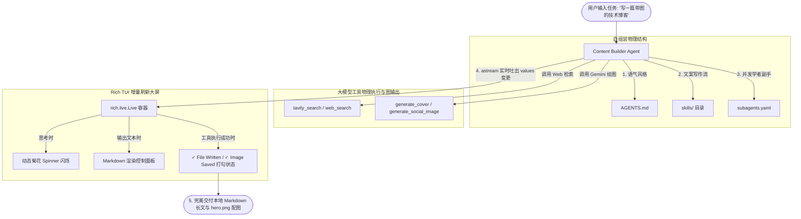

# Content Builder - 文件驱动组装与 Rich TUI 动态终端流式生成 Agent 深度剖析

`content-builder-agent` 展现了 Deep Agents monorepo 中最具艺术表现力的**实战多媒体生成与终端动态人机协同（Interactive Media Creation & Dynamic Rich TUI）**工程设计。该示例通过双核驱动：**物理文件声明式组装**（通过 `AGENTS.md` 注入语气，`skills/` 挂载文案重构，`subagents.yaml` 灵活解析研究子级）与 **Rich 物理流式终端展示**（使用 Python `rich` 库的 `Live` 和 `Spinner` 机制流式处理 `agent.astream` 消息），在本地终端里为开发者呈现了一个在执行写文件、网页搜索、大模型思考和 Gemini 绘图时具有极高响应爽感和掌控感的“实时大屏控制台”。

---

## 🎯 核心使用场景与设计目的

在本地运行或调试一个重度多步骤的 Agent（如：写一篇带插图的科技长文，并自动在本地排版发布）时，普通的命令行流输出面临两大体验盲点：
- **执行过程像黑盒**：大模型调用子 Agent 在后台查网页、在沙盒里请求图片接口可能需要 30 秒。在这个过程中，终端一片死寂，开发者完全不知道它是在努力运算还是已经发生网络抖动假死。
- **消息碎片化杂乱**：普通的 Print 输出会将“工具调用的 JSON 报文”、“大模型中间草稿”和“最终交付”混杂在一起，极难肉眼阅读。

`content-builder-agent` 依靠**物理配置解耦与 Live 响应式终端（Decoupled Configuration & Live Responisve TUI）**优雅地给出了技术示范：
1. **YAML-driven Subagents (YAML 解耦注册)**：由于 `create_deep_agent` 默认只支持在 Python 代码中以 dict 形式显式写死 subagents。该示例优雅地写了一个 `load_subagents` 解析器，从外部 `subagents.yaml` 中动态加载副手，实现了代码与配置的绝对分离。
2. **Rich Live View (TUI 动态刷新控制台)**：通过 Python `rich` 库，建立 `AgentDisplay` 渲染管道。配合 `agent.astream(..., stream_mode="values")` 的增量变更检测，实时在终端输出规整的 `You` 面板、`Agent` 思考面板与 `Image Generated` 的状态打勾动画，并带有一个动感小菊花 Spinner，体验爽感拉满。

---

## 🏗️ 架构与控制流



---

## 💻 核心逻辑剖析

### 1. 外部 YAML 子 Agent 的解析器设计 (`load_subagents`)
示例展示了如何将子 Agent 的行为大纲配置解耦到 `subagents.yaml` 中，并在 Python 侧通过反射动态挂载工具：
```python
import yaml
from pathlib import Path
from langchain_core.tools import tool

# 专供子级 Researcher 调用的网页搜索工具
@tool
def web_search(query: str) -> dict:
    """在网络上检索指定主题的信息。"""
    # 真实实现逻辑...
    return {"results": []}

def load_subagents(config_path: Path) -> list:
    # 物理工具映射字典
    available_tools = {
        "web_search": web_search,
    }
    
    with open(config_path) as f:
        config = yaml.safe_load(f)
        
    subagents = []
    for name, spec in config.items():
        subagent = {
            "name": name,
            "description": spec["description"],
            "system_prompt": spec["system_prompt"],
        }
        if "model" in spec:
            subagent["model"] = spec["model"]
        if "tools" in spec:
            # 动态根据名称反射获取物理 Python 函数
            subagent["tools"] = [available_tools[t] for t in spec["tools"]]
        subagents.append(subagent)
        
    return subagents
```
*提示*：其解析出的 `subagents` 列表可以直接传入 `create_deep_agent(subagents=...)`，避免了在 Python 代码里写几百行的 dict 字符串。

### 2. astream 动态菊花 Spinner 渲染管道
`rich` 的 `Live` 容器在运行时会强占终端输出。为了能在流式输出 AIMessage 的同时，在等待期（大模型思考或生成图片）动态显示 Spinner，需要进行精确的 `live.stop()` 与 `live.start()` 拦截：
```python
import asyncio
from rich.console import Console
from rich.live import Live
from rich.spinner import Spinner

console = Console()

class AgentDisplay:
    def __init__(self):
        self.printed_count = 0
        self.spinner = Spinner("dots", text="正在思考中...")

    def print_message(self, msg):
        # 负责美化打印 AIMessage / ToolMessage 的逻辑...
        pass

async def main():
    agent = create_content_writer()
    display = AgentDisplay()
    
    # 开启 Live 强占渲染容器，并将 Spinner 挂载进去
    with Live(display.spinner, console=console, refresh_per_second=10, transient=True) as live:
        # astream 以增量 value 状态吐出当前 Graph 的最新 messages
        async for chunk in agent.astream(
            {"messages": [("user", "写一篇博客并配图")]},
            stream_mode="values",
        ):
            if "messages" in chunk:
                messages = chunk["messages"]
                # 检测到有新消息产生，说明大模型吐出了文字或触发了工具
                if len(messages) > display.printed_count:
                    # 必须暂时中断 Live 容器，释放终端，方可正常 Print 面板
                    live.stop()
                    for msg in messages[display.printed_count:]:
                        display.print_message(msg)
                    display.printed_count = len(messages)
                    # 重新拉起 Live 容器和 Spinner 小菊花继续等待
                    live.start()
                    live.update(display.spinner)
```

---

## 🛠️ 项目实战复用指南

如果您希望在您的本地调试终端中，**为您的私有 Agent 系统装配一套响应爽感极高、带有动态菊花 Spinner、自动 Markdown 渲染和工具打勾动画的 TUI 控制台**，可以直接复用以下集成模块：

### 1. 简易 Rich TUI 调试脚手架

```python
# file: rich_tui_runner.py
import asyncio
from rich.console import Console
from rich.live import Live
from rich.spinner import Spinner
from rich.panel import Panel
from rich.markdown import Markdown
from langchain_core.messages import HumanMessage, AIMessage, ToolMessage
from deepagents import create_deep_agent
from langchain_anthropic import ChatAnthropic

console = Console()

class ElegantAgentDisplay:
    def __init__(self):
        self.printed_count = 0
        self.spinner = Spinner("bouncingBar", text=" [Bold Yellow]Agent 正在深思熟虑中...[/]")

    def update_waiting_text(self, text: str):
        self.spinner = Spinner("bouncingBar", text=f" [Bold Cyan]{text}[/]")

    def render_msg(self, msg):
        """格式化输出"""
        if isinstance(msg, HumanMessage):
            console.print(Panel(str(msg.content), title="[Bold Blue]🧑 You[/]", border_style="blue", expand=False))
            
        elif isinstance(msg, AIMessage):
            content = msg.content
            if content and content.strip():
                # 自动将大模型的输出渲染为高质感的终端 Markdown
                console.print(Panel(Markdown(content), title="[Bold Green]🤖 Agent[/]", border_style="green"))
                
            if msg.tool_calls:
                for tc in msg.tool_calls:
                    name = tc.get("name", "unknown")
                    args = tc.get("args", {})
                    # 打印出模型正在调用什么物理工具
                    console.print(f"  [bold magenta]⚡ [Executing Tool]:[/] {name} (params: {args})")
                    self.update_waiting_text(f"正在执行物理工具: {name} ...")
                    
        elif isinstance(msg, ToolMessage):
            # 打印工具执行成果
            console.print(f"  [bold green]✓ [Tool Finished]:[/] {msg.name or 'Tool'} 执行成功！")

async def run_rich_tui():
    elegant_display = ElegantAgentDisplay()
    
    # 模拟快速装配一个极简 Agent
    model = ChatAnthropic(model="claude-sonnet-4-6")
    agent = create_deep_agent(
        model=model,
        system_prompt="你是一个顶级技术作家，请多使用 Markdown 列表和加粗汇报成果。"
    )
    
    user_prompt = "为我起草一个 Python 3.12 异步 IO 的极简教程。"
    console.print("\n[Bold Underline]=== 智能终端 TUI 控制台启动 ===[/]\n")
    
    with Live(elegant_display.spinner, console=console, refresh_per_second=12, transient=True) as live:
        async for chunk in agent.astream(
            {"messages": [("user", user_prompt)]},
            stream_mode="values"
        ):
            if "messages" in chunk:
                msgs = chunk["messages"]
                if len(msgs) > elegant_display.printed_count:
                    live.stop() # 物理停止 Spinner
                    for m in msgs[elegant_display.printed_count:]:
                        elegant_display.render_msg(m)
                    elegant_display.printed_count = len(msgs)
                    live.start() # 重新拉起 Spinner
                    live.update(elegant_display.spinner)

if __name__ == "__main__":
    asyncio.run(run_rich_tui())
```

**复用提示**::
- **绝对的调试爽感**：在本地调试大模型应用时，频繁查看冗长的 console JSON 是一件极其痛苦的事。通过复用这套 Rich TUI 渲染管道，**大模型的思考过程、写文件动作和输出段落会被完美、漂亮地归拢在不同的 Panel 中，甚至自动为您渲染好 Markdown 样式**。这让您的控制台调试体验变得像在使用 Claude Code 或 Cursor 等顶尖商业终端一样流畅，极大提升了您的开发调试幸福感。
